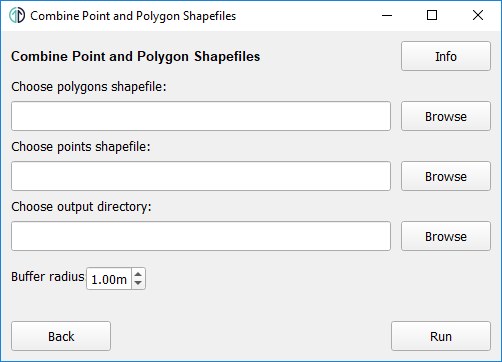
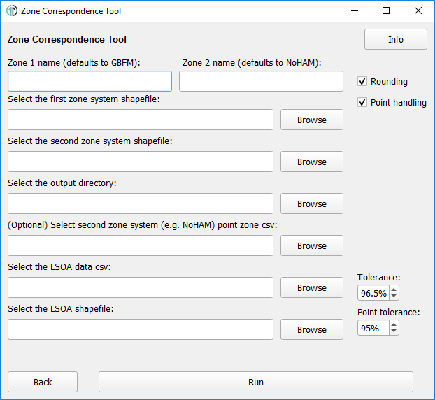
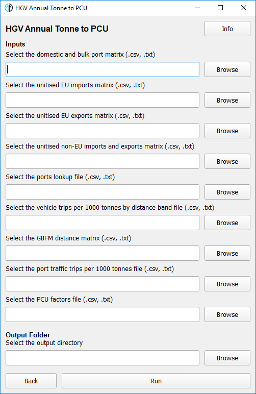
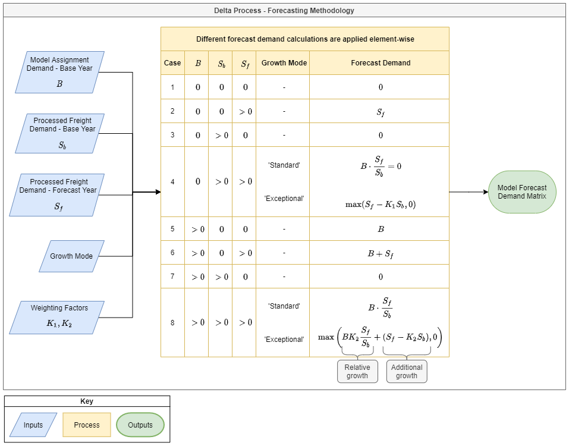

# Introduction
This document is provided as a user guide for installing and running the Local Freight Tool.
The Local Freight Tool provides a variety of functionality for developing HGV and LGV freight
demand matrices for model integration.

The document is split into the following sections:

- [Tool Location](#tool-location): describes where the Local Freight tool can be obtained from;
- [Installation](#installation): covers the requirements for the tool and how to install them;
- [Running Local Freight Tool](#running-local-freight-tool): covers information on how to run the tool; and
- [Tool Functionality](#tool-functionality): outlines all the functionality provided by the tool
  and provides information on how to run each module, including any required inputs and the
  expected outputs.

# Tool Location
The source code for the Local Freight tool is available on the [TfN-Freight-Tools](
  https://github.com/Transport-for-the-North/TfN-Freight-Tools) GitHub repository. For just running
the tool the required version can be selected by using the dropdown menu to select a branch then
clicking on the "Code" button and downloading the zip file. In order to edit the tool the GitHub
repository should be cloned, see [GitHub guide about remote repositories](
  https://docs.github.com/en/github/getting-started-with-github/about-remote-repositories).

Once the zip file has been downloaded it should be unzipped to the local machine then the
requirements should be installed using the instructions in the [Installation section](#installation).
When all the requirements are installed the Local Freight tool can be run following the steps
outlined in the [Running section](#running-local-freight-tool).

# Installation
Installation of the Local Freight Tool requires Anaconda (or Miniconda) to be installed, which
can be downloaded from [Anaconda.org](https://www.anaconda.com/products/individual#Downloads)
(or [Miniconda's website](https://docs.conda.io/en/latest/miniconda.html)). Once Anaconda has
been installed it can be used to install the Python requirements (listed in
[Packages Required](#packages-required) section) for running the tool.

## Creating conda Environment
A batch file has been supplied with the tool which will automatically install all the
Python requirements, this is called `install_tool.bat` and is found within the local_freight_tool
folder. Run `install_tool.bat` by double-clicking on it, if this is unsuccessful the requirements
can be installed with the following steps:

- Open Anaconda Prompt, accessible from Start Menu or Windows search, and navigate to the
  local_freight_tool directory.
- Create a new conda environment with `conda env create -f environment.yml`, use `y` to proceed
  if required.

## Packages required
The Python packages required by the Local Freight Tool are as follows (detailed version
information can be found in [environment.yml](environment.yml) which is provided with the
Python files):

- PyQT;
- Pandas;
- GeoPandas;
- Openpyxl;
- markdown;
- jinja2;
- packaging; and
- pyyaml.

# Running Local Freight Tool
Another batch file has been created to simplify the steps for running the tool, this file is
called `run_tool.bat` and can be found with the Python files in the local_freight_tool folder.
The tool can be launched by double clicking on `run_tool.bat`, if this is unsuccessful then it
can be launched with the following steps:

- Use Anaconda Prompt to navigate to the local_freight_tool directory;
- Activate the conda environment using `conda activate freighttool`; and
- Launch the menu using `python -m LFT`.

*Tip: start writing the file name and press tab, the command prompt will autocomplete it for you.
For more information on the command prompt see [Command Prompt cheat sheet](
  http://www.cs.columbia.edu/~sedwards/classes/2017/1102-spring/Command%20Prompt%20Cheatsheet.pdf).*

# Tool Functionality
This section outlines the functionality provided in the tool, this functionality is split across
a number of modules which can be accessed from the main menu. The main menu of the tool is shown
in the image below, it is split into the following three sections:

<!-- TODO: Update this section once the final modules have been finished -->
- Pre-Processing: this section contains a variety of modules for getting inputs ready for the
  conversion processes.
- Conversion: this sections provides the main modules for producing HGV and LGV demand matrices.
- Utilities: this section contains a variety of utility functions that can perform many matrix
  calculations, demand forecasting and cost conversion.


## 0: Combine Point and Polygon Shapefiles
This module provides functionality to combine two shapefiles where one contains points
and the other contains polygons. For example, this allows the GBFM zone system shapefiles to be
combined into a single file for use in module 1: [Produce Zone Correspondence](#1-produce-zone-correspondence),
as the GBFM zone system is provided as one polygon shapefile which doesn't contain all the zones
and a point (centroids) shapefile which contains all zones.



The menu for this module is shown above and the inputs are listed in the table below, once these
have been entered the "Run" button is clicked to start the process. The process runs through
the following steps to produce the outputs (see outputs table below):

1. Find any zones in the points shapefile which aren't in the polygons shapefile, the zone
  IDs are expected to be given in a column with the name "UniqueID" in both shapefiles. If no zones
  are present in the points shapefile which aren't already in the polygon shapefile then the
  process stops here and no output is created.
2. Create a buffer around all points found to convert these to polygons, the buffer radius can
  be provided in the interface.
3. The newly created polygons are combined with all other
  polygons to produce the output combined shapefile.

The output provided by this process can then be given to module 1 in order to create a
correspondence between two zone systems. This module has been developed to be flexible so that it
will work with any pair of polygon and point shapefiles as long as they both contain a "UniqueID"
column.

Table: Inputs for Combine Centroid and Polygon Shapefiles module

| Input                      |       Type        | Optional | Default | Description                                                                                      |
| -------------------------- | :---------------: | :------: | :-----: | ------------------------------------------------------------------------------------------------ |
| Polygon shapefile          |       .shp        |    No    |    -    | The shapefile containing all the polygon zones, **must contain a column named "UniqueID"**.      |
| Centroid (point) shapefile |       .shp        |    No    |    -    | The shapefile containing the centroids of all zones, **must contain a column named "UniqueID"**. |
| Output directory           |      Folder       |    No    |    -    | The folder where the output shapefile will be saved.                                             |
| Buffer radius              | Real (0.01 - 10m) |    No    |  1.00m  | The radius of the circle (in metres) around the centroid point, created for the output file.     |

Table: Outputs from Combine Centroid and Polygon Shapefiles module

| File                                | File Type | Description                                                                                                                                                                                                                                                                              |
| ----------------------------------- | :-------: | ---------------------------------------------------------------------------------------------------------------------------------------------------------------------------------------------------------------------------------------------------------------------------------------- |
| `{polygon_shapefile_name}-combined` |   .shp    | Polygon shapefile containing all the information from the input polygon shapefile plus circular representations of any zones from the centroids shapefile. This file includes any information available from the centroid shapefile with the same column names as the polygon shapefile. |

## 1: Produce Zone Correspondence
This module is used to build a zone correspondence lookup between two shapefiles, flexibility of
this module allows it to create a lookup between any two polygon shapefiles containing zones
(assuming they follow the correct format). However the primary purpose of this module is to
produce a lookup between the GBFM and NoHAM zone systems to be used when creating the model demand
matrices in later modules of the Local Freight Tool.

The inputs for this module are outlined in the table below, some of which are optional depending if
point handling or rounding are turned on. Once inputs are filled in "Run" can be clicked to start
the process and a progress window will pop up to alert you at what stage the process is at and
will provide information on any issues with the inputs that have been found. The outputs for
the process are defined in the table below and should be checked thoroughly before the lookup
is used for anything, the `zone_correspondence_log` provides more information on specific areas
which will need detailed checking.

The zone correspondence process takes the two input shapefiles and performs spatial analysis to
calculate the overlap percentages between the two zone systems in order to determine the
correspondence (see [Zone Correspondence Calculations](#zone-correspondence-calculations) for more
detail). These overlaps will be used as the spatial splitting factors but two additional options
are provided to produce a more robust correspondence, these are as follows:

- Rounding: this option will use the tolerance value to filter out any slithers (see
  [Zone Correspondence Calculations](#zone-correspondence-calculations) for more details) and will
  round all remaining splitting factors to make sure that each zone from the first zone system has
  splitting factors with the second zone system which sum to exactly 1. This method will stop any
  demand being lost when using the lookup to convert from the first to the second zone system
  (**recommend having this turned on**).
- Point handling: this option will use the LSOA data and shapefile to determine the splitting
  factors for point zones in the second zone system, instead of just using the spatial factors
  (see [Zone Correspondence Calculations](#zone-correspondence-calculations) for more details).
  Point zones are defined as small zones which are expected to have more demand than there size
  would suggest, e.g. ports or distribution centres, these can be given to the tool as a list of
  zone IDs (**recommended method**) or can be calculated by the tool based on the point tolerance.



Table: Zone correspondence inputs

| Input                              |      Type      | Condition                            | Optional | Default | Description                                                                                                                                                                                                             |
| ---------------------------------- | :------------: | ------------------------------------ | :------: | :-----: | ----------------------------------------------------------------------------------------------------------------------------------------------------------------------------------------------------------------------- |
| Zone 1 name                        |     String     | -                                    |   Yes    |  gbfm   | Name of zoning system to be converted from.                                                                                                                                                                             |
| Zone 2 name                        |     String     | -                                    |   Yes    |  noham  | Name of zoning system to convert to.                                                                                                                                                                                    |
| First zone system                  |      .shp      | -                                    |    No    |    -    | Zoning system shapefile to be converted from, zone ID column should be called "UniqueID".                                                                                                                               |
| Second zone system                 |      .shp      | -                                    |    No    |    -    | Zoning system shapefile to convert to, zone ID column should be called "unique_id".                                                                                                                                     |
| Output directory                   |   Directory    | -                                    |    No    |    -    | Directory where output files will be saved.                                                                                                                                                                             |
| Rounding                           |    Checkbox    | -                                    |   Yes    |   On    | Turns on rounding option (**recommend having this turned on**), see above for more details on this option.                                                                                                              |
| Tolerance                          |      Real      | Point handling or rounding turned on |    No    |  98.0%  | Tolerance used to filter out small overlaps between zones, changing this value will affect how much overlap is needed for zones to be kept in the correspondence (98% is recommended for GBFM to NoHAM correspondence). |
| Point handling                     |    Checkbox    | -                                    |   Yes    |   On    | Turns on point handling option, see above for more details on this option.                                                                                                                                              |
| Point tolerance                    |    Integer     | Point handling turned on             |    No    |   95%   | Tolerance used to find point zones in second zone system when no point zone list is specified.                                                                                                                          |
| Second zone system point zone list | .csv or String | Point handling turned on             |   Yes    |    -    | List of point zones in the second zoning system (e.g. NoHAM). Must be a csv with "zone_id" column name. If unspecified, then the point tolerance is used to find the point zones.                                       |
| LSOA data                          |      .csv      | Point handling turned on             |    No    |    -    | CSV containing LSOA data (such as employment) to perform non-spatial point zone handling. The file must have the LSOA zone IDs in the "lsoa11cd" column and the relevant data in the "var" column.                      |
| LSOA shapefile                     |      .csv      | Point handling turned on             |    No    |    -    | LSOA shapefile, with zone IDs in "LSOA11CD" column.                                                                                                                                                                     |

Table: Zone correspondence outputs

| File                                                 | File Type             | Description                                                                                                                                                                                                                                                                                                                                                                                                                                                                                                                                                                                                    |
| ---------------------------------------------------- | --------------------- | -------------------------------------------------------------------------------------------------------------------------------------------------------------------------------------------------------------------------------------------------------------------------------------------------------------------------------------------------------------------------------------------------------------------------------------------------------------------------------------------------------------------------------------------------------------------------------------------------------------- |
| `{zone_1}_to_{zone_2}` `_spatial_correspondence.csv` | Comma-separate values | Spatial correspondence with no rounding or point handling, includes adjustment factors for converting from zone system 1 to zone system 2 and vice versa. **This file is provided for checking only, use zone correspondence output (below) for any rezoning.** Contains the following 4 columns:<br>- `{zone_1}_zone_id`: zone ID for first zone system<br>- `{zone_2}_zone_id`: zone ID for corresponding zone in second zone system<br>- `{zone_1}_to_{zone_2}`: spatial splitting factor to go from zone system 1 to 2<br>- `{zone_2}_to_{zone_1}`: spatial splitting factor to go from zone system 2 to 1 |
| `{zone_1}_to_{zone_2}` `_zone_correspondence.csv`    | Comma-separate values | Zone correspondence with all rounding and point handling options applied (if selected), in the correct format for use in the other modules of the tool. Contains the following 3 columns:<br>- `{zone_1}_zone_id`: zone ID for the first zone system<br>- `{zone_2}_zone_id`: zone ID for the corresponding zone in the second zone system<br>- `{zone_1}_to_{zone_2}`: splitting factor to go from zone system 1 to 2                                                                                                                                                                                         |
| `zone_correspondence_log.xlsx`                       | Excel Workbook        | Spreadsheet containing results from the checks performed by the tool, **this file should be checked thoroughly before using the zone correspondence output**. Contains the following 4 worksheets:<br>- `Parameters`: list of input parameters and their selected values<br>- `{zone_1}_missing`: list of zone system 1 zones missing from zone correspondence<br>- `{zone_2}_missing`: list of zone system 2 zones missing from zone correspondence<br>- `point_handling`: if point handling was on, this lists all the zones affected by point zone handling                                                 |

### Zone Correspondence Calculations
This section provides the technical calculations performed by the zone correspondence process to
produce the lookup between the two zone systems.

<!-- Note: GitHub doesn't render markdown equations -->

#### Spatial Correspondence
The spatial correspondence adjustment factors are defined as:

$$
F_{spatial}(Z_{1i} \rightarrow Z_{2j}) = \frac{A(Z_{1i} \cap Z_{2j})}{A(Z_{1i})}
$$

where:

- $Z_{1i}$ is zone i in the first zone system (usually GBFM);
- $Z_{2j}$ is zone j in the second zone system (usually model);
- $A(Z_{1i} \cap Z_{2j})$ is the area of the intersection between the two zones; and
- $A(Z_{1i})$ is the area of zone i in the first zone system.

The GeoPandas overlay function is used to calculate the intersecting area of the zones; see
[GeoPandas documentation](https://geopandas.org/set_operations.html) for more details. If neither
rounding nor point handling are selected then the spatial correspondence is the final correspondence.

#### Point Handling (optional)
Point handling affects the point zones in the second zone system and any other zones in that system
which share a correspondence with the same zone for the first zone system. A list of point zones
can be provided to the tool (recommended) but if not given then the tool will define them as any
zones which satisfy both of the following:

$$
F_{spatial}(Z_{1i} \rightarrow Z_{2j}) < 1 - T_{pt}
$$

$$
F_{spatial}(Z_{2j} \rightarrow Z_{1i}) > T_{pt}
$$

where $T_{pt}$ is the point tolerance. This method might miss some point zones, or include some
non-point zones, so it is recommended to **check the point handling sheet of the output log
spreadsheet.**

Point handling has been designed to use LSOA data for calculating the adjustment factor, with the
$F_{non-spatial}$ formulae below, to ensure a more appropriate proportion of the demand is given
to the point zones when converting to the second zone system. However the flexibility of the tool
permits any data which satisfies the conditions outlined in the inputs table to be used for the
non-spatial calculations. For point zone $Z_{2pt}$ and $\{Z_{2j}\}$, the set of zones which overlap
with the same zone $Z_{1k}$ from the first zone system, the non-spatial adjustment factors for the
point zones are given by:

$$
F_{non-spatial}(Z_{1k} \rightarrow Z_{2pt})
  = \left( F_{spatial}(Z_{1k} \rightarrow Z_{2pt}) + \sum_{j} F_{spatial}(Z_{1k} \rightarrow Z_{2j}) \right)
    \cdot \frac{V(L_{pt})}{\sum_n V(L_{n})}
$$

$$
F_{non-spatial}(Z_{1k} \rightarrow Z_{2pt})
  = \left( \frac{A(Z_{1k} \cap Z_{2pt})}{A(Z_{1k})} + \sum_{j} \frac{A(Z_{1k} \cap Z_{2j})}{A(Z_{1k})} \right)
    \cdot \frac{V(L_{pt})}{\sum_n V(L_{n})}
$$

The non-spatial adjustment factors for the non-point zones, which interact with the same zone in the
first zone system, are given by:

$$
F_{non-spatial}(Z_{1k} \rightarrow Z_{2m})
  = \left( F_{spatial}(Z_{1k} \rightarrow Z_{2pt}) + \sum_{j} F_{spatial}(Z_{1k} \rightarrow Z_{2j}) \right)
    \cdot \frac{\sum_l V(L_{l})}{\sum_n V(L_{n})}
$$

$$
F_{non-spatial}(Z_{1k} \rightarrow Z_{2m})
  = \left( \frac{A(Z_{1k} \cap Z_{2pt})}{A(Z_{1k})} + \sum_{j} \frac{A(Z_{1k} \cap Z_{2j})}{A(Z_{1k})} \right)
    \cdot \frac{\sum_l V(L_{l})}{\sum_n V(L_{n})}
$$

where:

- $Z_{2m} \in \{Z_{2j}\}$;
- $L_{pt}$ is the LSOA which contains $Z_{2pt}$;
- $V(L_{pt})$ is the LSOA data (in var column of the inputted employment CSV) for $L_{pt}$;
- $\{L_n\}$ is the set of LSOAs which overlap with $Z_{1k}$; and
- $\{L_l\}$ is the set of LSOAs which overlap with $Z_{2m}$, excluding $L_{pt}$.

##### Point Handling Example


In the above example:

$$
A(GBFM_1 \cap NoHAM_{pt}) + A(GBFM_1 \cap NoHAM_1) = A(GBFM_1)
$$

so:

$$
F_{non-spatial}(GBFM_1 \rightarrow NoHAM_{pt}) = \frac{V(LSOA_4)}{\sum_{n=1}^6 V(LSOA_n)}
$$

$$
F_{non-spatial}(GBFM_1 \rightarrow NoHAM_1) = \frac{\sum_{l=1,l \ne 4}^6 V(LSOA_l)}{\sum_{n=1}^6 V(LSOA_n)}
$$

#### Rounding (optional)
When rounding or point handling is turned on, small overlaps (slithers) these are defined as
satisfying both of the following:

$$
F_{spatial}(Z_{1i} \rightarrow Z_{2j}) < 1 - T
$$

$$
F_{spatial}(Z_{2j} \rightarrow Z_{1i}) < 1 - T
$$

where $T$ is tolerance. If the above conditions are both satisfied then the row that features zone
i from the first zone system and zone j from the second is removed from the zone correspondence. If
rounding is off but point handling is on then these rows are removed for the point handling aspect
of the calculations then reinserted.

If only the first condition above is satisfied then the row is only removed if both zones in the
pairing are present elsewhere in the correspondence output. The reason both conditions are used is
because zones which have a large difference in size, between the two zone systems, could have a very
small overlap in one direction even if they are completely within the other zone, see example below.


When rounding is on, the tool will also check that the first zone system to second zone system
adjustment factors sum to 1 for all zones in the first zone system.

- If a zone in the first zone system maps to a single zone in the second (after removing slithers)
  the adjustment factor is set to 1.
- If a zone in the first zone system ($Z_{1i}$) maps to multiple zones in the second ($\{Z_{2j}\}$),
  and the sum of the adjustment factors is not 1, then it is adjusted according to:

$$
F_{adjusted}(Z_{1i} \rightarrow Z_{2k}) = F(Z_{1i} \rightarrow Z_{2k}) +
  \frac{1-\sum_{j=0}^n F(Z_{1i} \rightarrow Z_{2j})}{n}
$$

- where:
  - $Z_{2k} \in \{Z_{2j}\}$;
  - $n$ is the number of zones in $\{Z_{2j}\}$; and
  - $F(Z_{1i} \rightarrow Z_{2k})$ is the adjustment factor calculated prior to rounding, either
    spatially or non-spatially.

#### Missing Zones
At the end of the process the zone IDs present in the zone correspondence lookup are compared to
those in the input shapefiles and any missing zones are added to the log file. Missing zones are
due to no overlap being found between zones in the two zone systems. The missing zones sheet of
the zone correspondence log spreadsheet should be checked to find out where this has occurred and
these should be fixed by manually updating the input or outputs.

- The input zone system shapefiles could be updated to move the missing zones into a more sensible
  location where they overlap with the other zone system; or
- The output lookup could be manually updated to add in the correspondence for any missing zones
  based on the user's understanding of the two zone systems.

## 2: Time Profile Builder

This module is used to produce the time profile selection to be used as an input in the
[Annual PCU to Model Time Period PCU](#4-annual-pcu-to-model-time-period-pcu) conversion. It enables
the user to set up to seven different time profiles, including the name of the profile, days to use,
the time period start and end hours, and the months. The months selected are used for all time
profiles. The profile builder menu is shown below.


The user is expected to enter a name for the time period selection. The days and time periods have
default values which can be changed by selecting the relevant checkboxes and drop down menus. To
create the selected profiles, the user must click 'Save Selection'. A warning appears when the time
periods selected do not add up to 24 hours. The output is summarised in the table below.

Table: Time Profile Builder output

| Name              | Type | Columns  | Description                                                        |
| ----------------- | ---- | -------- | ------------------------------------------------------------------ |
|                   |      | name     | Name of the time profile                                           |
|                   |      | days     | Days of the week in time profile.                                  |
| Profile_Selection | CSV  | hr_start | Start hour of time profile                                         |
|                   |      | hr_end   | End hour of time profile                                           |
|                   |      | months   | Months for all time profiles (this column is the same in all rows) |

## 3: HGV Annual Tonne to Annual PCU Conversion

The HGV Annual Tonne to Annual PCU Conversion module enables the split and conversion of GBFM HGV annual tonnage
matrices into rigid and articulated annual PCU matrices. The interface is shown below.



The conversion and splitting process is based on the specification proposed by Ian Williams in the technical note
`035_Separating_Rigids_Artics`. The process is detailed in the flowchart below.


The inputs and outputs of the process are outlined in the following tables.

Table: Inputs for HGV annual tonne to annual PCU conversion module

| Input                                          | Type | Description                                                                                                                                              | Required columns                                                                           | Required rows                                                                         |
| ---------------------------------------------- | ---- | -------------------------------------------------------------------------------------------------------------------------------------------------------- | ------------------------------------------------------------------------------------------ | ------------------------------------------------------------------------------------- |
| Domestic and bulk port matrix                  | CSV  | Base year domestic and bulk-port traffic                                                                                                                 | Origin, destination, trips, column names are optional but columns must be in correct order | N/A                                                                                   |
| Unitised EU imports matrix                     | CSV  | Annual imported tonnes from GB ports to inland GBFM zones for unitised (non-bulk) trade to GB from European countries (including the island of Ireland)  | Origin, destination, trips, column names are optional but columns must be in correct order | N/A                                                                                   |
| Unitised EU exports matrix                     | CSV  | Annual exported tonnes from inland GBFM zones to GB ports for unitised (non-bulk) trade from GB to European countries (including the island of Ireland); | Origin, destination, trips, column names are optional but columns must be in correct order | N/A                                                                                   |
| Unitised non-EU imports and exports matrix     | CSV  | Annual tonnes between GB ports and inland GBFM zones for unitised (non-bulk) trade between GB and non-European countries                                 | "Imp0Exp1", "GBPortctr", "GBRawZone", "Traffic"                                            | N/A                                                                                   |
| Ports lookup                                   | CSV  | Shows lookup between GBPortctr and GBFM zones                                                                                                            | "GBPortctr", "GBZone"                                                                      | All ports in the unitised non-EU imports and exports matrix                           |
| Vehicle trips per 1000 tonnes by distance band | CSV  | Artic/rigid factors to apply for each trip distance per 1000 tonnes                                                                                      | "start", "end", "rigid", "artic"                                                           | N/A                                                                                   |
| GBFM distance matrix                           | CSV  | GBFM distance skim                                                                                                                                       | Origin, destination, trips, column names are optional but columns must be in correct order | All GBFM zones in domestic and bulk port matrix                                       |
| Port traffic trips per 1000 tonnes file        | CSV  | Articulated and rigid port traffic trip factors                                                                                                          | "type", "direction", "accompanied", "artic", "rigid"                                       | Factors for bulk traffic in both directions, and unitised traffic import and exports. |
| PCU factors                                    | CSV  | Articulated and rigid tonne to PCU factors to apply                                                                                                      | "zone", "direction", "artic", "rigid"                                                      | Row with default artic and rigid values                                               |

Table: Outputs for HGV annual tonne to annual PCU conversion module

| Output                  | Type | Description                                                                                                                                                                                                                                                                                                                                                                                                                                                                                                                                                                                                                           |
| ----------------------- | ---- | ------------------------------------------------------------------------------------------------------------------------------------------------------------------------------------------------------------------------------------------------------------------------------------------------------------------------------------------------------------------------------------------------------------------------------------------------------------------------------------------------------------------------------------------------------------------------------------------------------------------------------------- |
| artic_total_annual_pcus | CSV  | Annual articulated PCUs csv with columns "origin", "destination" and "trips"                                                                                                                                                                                                                                                                                                                                                                                                                                                                                                                                                          |
| rigid_total_annual_pcus | CSV  | Annual rigid PCUs csv with columns "origin", "destination" and "trips"                                                                                                                                                                                                                                                                                                                                                                                                                                                                                                                                                                |
| Tonne_to_pcu_log        | XLSX | Log of the process, containing a list of inputs provided, processes completed, errors if they occurred, and a summary of matrix statistics. Contains the following sheets:<br>- `process`: indicates which processes completed and any errors that occurred;<br>- `inputs`: a list of all the input files<br>- `matrix_summaries`: summaries of the four input HGV matrices, the rigid and articulated total annual trip matrices, and the rigid and articulated total annual PCU matrices<br>- `distance_bands`: the distance bands used<br>- `port_traffic`: the port traffic factors used<br>- `pcu_factors`: the PCU factors used |


## 4: HGV Annual PCU to Model Time Period PCU
This module converts the articulated and rigid matrices (created by module 3: [HGV Annual Tonne to
Annual PCU Conversion](#3-hgv-annual-tonne-to-annual-pcu-conversion) from annual PCUs to model time period PCUs, based on the time periods defined
by module 2: [Time Profile Builder](#2-time-profile-builder).


This process requires the annual PCU matrices and time period information as inputs (more details
in the inputs table below) and produces the time period articulated, rigid and combined matrices
as well as a log spreadsheet summarising the process (more details in the outputs table below). The
log spreadsheet provides a summary of the calculations and the output matrices, **these tables
should all be checked in detail before using the outputs**, in order to assist with checking the
matrix summaries have been highlighted red or green to outline where more detailed checks are needed.

***Note:** Even if the matrix summaries are all highlighted green some manual checks should still be
undertaken to make sure the outputs have been checked to an appropriate level depending on the use
case.*

Table: Inputs for the HGV annual PCU to model time period PCU module

| Input                          |      Type      | Description                                                                                                                                                                                                                                                                                                                                                                                                                                                                                                                                                                                    |
| :----------------------------- | :------------: | :--------------------------------------------------------------------------------------------------------------------------------------------------------------------------------------------------------------------------------------------------------------------------------------------------------------------------------------------------------------------------------------------------------------------------------------------------------------------------------------------------------------------------------------------------------------------------------------------- |
| HGV Distributions              | Excel Workbook | Spreadsheet containing the DfT road traffic statistics (TRA) tables required for calculating the time period factors, should contain the following sheets:<br>- TRA3105: the HGV road type distributions with columns Road Type, Rigid, Articulated and All HGVs;<br>- TRA0305: the monthly distributions for HGV and road types with columns Road Type, Month and HGV; and<br>- WEEKLY PROFILE: weekly distributions for articulated and rigid should contain columns Road Type, Time and an articulated and rigid column for each day.<br> *This spreadsheet is available on TfN's U drive.* |
| Time Periods Profiles          |      CSV       | Time period definitions file, created by module 2, should contain the following columns:<br>- name: the name of the time period (used when labelling output matrices);<br>- days list of the selected days as numbers (0 - 6) e.g. [0, 1, 2, 3, 4] for all weekdays;<br>- hr_start: the starting hour of the time period, should be a number (0 - 23 inclusive);<br>- hr_end: the ending hour of the time period, should be a number (0 - 23 inclusive); and<br>- months: the month number (0 - 11 inclusive) as a list e.g. [0, 1, 3] to select January, February and April.                  |
| Model Year                     |    Integer     | Base year of the model, used for calculating the average number of weeks in a month during the time period conversions.                                                                                                                                                                                                                                                                                                                                                                                                                                                                        |
| Articulated Annual PCUs Matrix |      CSV       | Annual PCU matrix for the articulated HGVs created by module 4, should contain the following columns: origin, destination and trips, column names are optional but columns must be in correct order.                                                                                                                                                                                                                                                                                                                                                                                           |
| Rigid Annual PCUs Matrix       |      CSV       | Annual PCU matrix for the rigid HGVs created by module 4, should contain the following columns: origin, destination and trips, column names are optional but columns must be in correct order.                                                                                                                                                                                                                                                                                                                                                                                                 |
| Output Folder                  |      Text      | Path to the existing folder to save the outputs to.                                                                                                                                                                                                                                                                                                                                                                                                                                                                                                                                            |

Table: Outputs from the HGV annual PCU to model time period PCU module

| Output                                                                           |      Type      | Description                                                                                                                                                                                                                                                                                                                                                                                                                                                                                                                                                                                                             |
| :------------------------------------------------------------------------------- | :------------: | :---------------------------------------------------------------------------------------------------------------------------------------------------------------------------------------------------------------------------------------------------------------------------------------------------------------------------------------------------------------------------------------------------------------------------------------------------------------------------------------------------------------------------------------------------------------------------------------------------------------------- |
| `time_period_conversion_log`                                                     | Excel Workbook | Spreadsheet summarising the inputs, intermediary steps and statistics for the output matrices, contains the following sheets:<br>- Notes: brief description of spreadsheet;<br>- Input Parameters: list of all the input parameters provided;<br>- Monthly Avg Profile: weighted average monthly HGV distribution;<br>- Weekly Avg Profile: weighted average weekly (and hourly) HGV distribution;<br>- Time Period Factors: summary of the input time periods and the calculated factors for each; and<br>- Matrix Summaries: summary statistics for each of the output matrices, highlighted to assist with checking. |
| `{time period}_intermediate/{time period}_HGV_artic-{original zone system name}` |      CSV       | Time period PCUs matrix for articulated HGVs **before** rezoning to new zone system, contains origin, destination and trips columns.                                                                                                                                                                                                                                                                                                                                                                                                                                                                                    |
| `{time period}_intermediate/{time period}_HGV_artic-{rezoned zone system name}`  |      CSV       | Time period PCUs matrix for articulated HGVs **after** rezoning to new zone system, contains origin, destination and trips columns.                                                                                                                                                                                                                                                                                                                                                                                                                                                                                     |
| `{time period}_intermediate/{time period}_HGV_rigid-{original zone system name}` |      CSV       | Time period PCUs matrix for rigid HGVs **before** rezoning to new zone system, contains origin, destination and trips columns.                                                                                                                                                                                                                                                                                                                                                                                                                                                                                          |
| `{time period}_intermediate/{time period}_HGV_rigid-{rezoned zone system name}`  |      CSV       | Time period PCUs matrix for rigid HGVs **after** rezoning to new zone system, contains origin, destination and trips columns.                                                                                                                                                                                                                                                                                                                                                                                                                                                                                           |
| `{time period}_HGV_combined-{rezoned zone system name}`                          |      CSV       | Time period PCUs matrix for **both vehicle types** (articulated + rigid) **after** rezoning to the new zone system, contains origin, destination and trips columns.                                                                                                                                                                                                                                                                                                                                                                                                                                                     |

## 5: LGV Model

This module contains the functionality for running the LGV model which includes calculating trip
ends, using a gravity model to generate annual trip matrices and converting the annual matrices to
time periods. The interface is shown below.


The following sections contain detailed information on the expected inputs and outputs, as well as
some information on the methodology for the LGV model.

### LGV Model Inputs

The LGV model has a number of input files which can be provided in the GUI, or via a configuration
file (example below). This section details all of the input files which are needed in order to run
the LGV model.

Example of the configuration file:

```
[LGV File Paths]
households data = \path\to\households data.csv
households zone correspondence = \path\to\households zone correspondence.csv
bres data = \path\to\bres data.csv
bres zone correspondence = \path\to\bres zone correspondence.csv
voa data = \path\to\voa data.csv
voa zone correspondence = \path\to\voa zone correspondence.csv
lgv parameters = \path\to\LGV_input_tables.xlsx
qs606ew = \path\to\QS606EW.csv
qs606sc = \path\to\QS606UK.csv
sc&w dwellings = \path\to\scotland_wales_dwellings.csv
e dwellings = \path\to\england dwellings.xlsx
ndr floorspace = \path\to\NDR_business_floorspace.csv
lsoa lookup = \path\to\LSOA lookup.csv
msoa lookup = \path\to\msoa lookup.csv
lad lookup = \path\to\LAD lookup.csv
model study area = \path\to\model study area.csv
cost matrix = \path\to\LGV_distance_matrix.csv
trip distributions spreadsheet = \path\to\LGV_trip_distributions.xlsx
calibration matrix = \path\to\LGV_GM_calibration_matrix.csv
output folder = \path\to\outputs\folder
```

#### Household Projections & Zone Correspondence

UK households projections for the model year at MSOA level, data can be extracted from TEMPro. This
data should contain the number of households per MSOA for the model year. The data extracted from
TEMPro contains a number of columns only two of which are required for the model, these are
summarised in the table below, any additional columns are ignored. This data should be provided in
a comma-separated values (CSV) file.

Table: Required columns for the UK household projections data

|   Column Name    | Data Type | Description                                                |
| :--------------: | :-------: | :--------------------------------------------------------- |
| Area Description |   Text    | MSOA area code e.g. E02003616                              |
|       HHs        |   Real    | The number of households projected to be in that MSOA zone |
|       Jobs       |   Real    | The number of jobs projected to be in that MSOA zone       |

In addition to the households data the model also requires a zone correspondence file which provides
the lookup between the MSOA and the model zones, the correspondence file requires three columns which
are summarised in the table below. The zone correspondence file can be created using module
[1: Produce Zone Correspondence](#1-produce-zone-correspondence).

Table: Required columns for the UK household zone correspondence, column names are ignored the
columns just need to be in the correct order.

| Column | Data Type | Description                         |
| :----: | :-------: | :---------------------------------- |
|   1    |   Text    | MSOA area code e.g. E02003616       |
|   2    |  Integer  | Corresponding model zone ID         |
|   3    |   Real    | Splitting factor for correspondence |

#### BRES Data & Zone Correspondence

The Business Register and Employment Survey (BRES) is available from [NOMIS](https://www.nomisweb.co.uk/datasets/newbres6pub)
and contains the number of employees for different industrial sectors at LSOA (Scottish data zone)
level, at time of writing the data is provided up to 2019. The LGV model requires the data to be
extracted for all LSOAs (England and Wales) and data zones (Scotland) at the model year, all broad
industrial groups and all employees should be included in the output.

The model expects the file to be saved as a comma-separated values (CSV) file with the first eight
rows used for meta data and the column names on row nine, all required columns are listed in the
table below.

Table: Required columns for the BRES data, column names must be exactly as listed. Any columns not
listed will be ignored.

| Column Name                                                                                                                  | Data Type | Description                                |
| :--------------------------------------------------------------------------------------------------------------------------- | :-------: | :----------------------------------------- |
| Area                                                                                                                         |   Text    | Description/name of area type              |
| mnemonic                                                                                                                     |   Text    | Data zone or LSOA area code                |
| A : Agriculture, forestry and fishing                                                                                        |   Real    | Number of employees for this industry type |
| B : Mining and quarrying                                                                                                     |   Real    | Number of employees for this industry type |
| C : Manufacturing                                                                                                            |   Real    | Number of employees for this industry type |
| D : Electricity, gas, steam and air conditioning supply                                                                      |   Real    | Number of employees for this industry type |
| E : Water supply; sewerage, waste management and remediation activities                                                      |   Real    | Number of employees for this industry type |
| F : Construction                                                                                                             |   Real    | Number of employees for this industry type |
| G : Wholesale and retail trade; repair of motor vehicles and motorcycles                                                     |   Real    | Number of employees for this industry type |
| H : Transportation and storage                                                                                               |   Real    | Number of employees for this industry type |
| I : Accommodation and food service activities                                                                                |   Real    | Number of employees for this industry type |
| J : Information and communication                                                                                            |   Real    | Number of employees for this industry type |
| K : Financial and insurance activities                                                                                       |   Real    | Number of employees for this industry type |
| L : Real estate activities                                                                                                   |   Real    | Number of employees for this industry type |
| M : Professional, scientific and technical activities                                                                        |   Real    | Number of employees for this industry type |
| N : Administrative and support service activities                                                                            |   Real    | Number of employees for this industry type |
| O : Public administration and defence; compulsory social security                                                            |   Real    | Number of employees for this industry type |
| P : Education                                                                                                                |   Real    | Number of employees for this industry type |
| Q : Human health and social work activities                                                                                  |   Real    | Number of employees for this industry type |
| R : Arts, entertainment and recreation                                                                                       |   Real    | Number of employees for this industry type |
| S : Other service activities                                                                                                 |   Real    | Number of employees for this industry type |
| T : Activities of households as employers;undifferentiated goods-and services-producing activities of households for own use |   Real    | Number of employees for this industry type |
| U : Activities of extraterritorial organisations and bodies                                                                  |   Real    | Number of employees for this industry type |

In addition to the BRES data the model also requires a zone correspondence file which provides
the lookup between the LSOA/data zones and the model zones, the correspondence file requires three
columns which are summarised in the table below. The zone correspondence file can be created using
module [1: Produce Zone Correspondence](#1-produce-zone-correspondence).

Table: Required columns for the BRES zone correspondence, column names are ignored the
columns just need to be in the correct order.

| Column | Data Type | Description                                 |
| :----: | :-------: | :------------------------------------------ |
|   1    |   Text    | LSOA or data zones area code e.g. E02003616 |
|   2    |  Integer  | Corresponding model zone ID                 |
|   3    |   Real    | Splitting factor for correspondence         |

#### VOA Data & Zone Correspondence

The Valuation Office Agency (VOA) non domestic ratings list contains information regarding business
premises and valuations across England and Wales, the data is available on [GOV.UK](https://voaratinglists.blob.core.windows.net/html/rlidata.htm).
The data should be downloaded from the government website and provided as is to the model, the data
is in a CSV format but the columns are separated with "*" instead of ",".

The model expects the VOA dataset to contain 28 columns but with no column headers, a list of all
the columns is provided in the table below.

Table: Required columns for the VOA non domestic ratings list data, the file should not contain a
header column but the column must be in the correct order. More information on the data provided
by VOA can be found in the [VOA 2017 Compiled Rating List Data Specification](https://voaratinglists.blob.core.windows.net/html/documents/2017%20Compiled%20List%20and%20SMV%20Data%20Specification.pdf),
column names and descriptions provided in the data specification report.

| Column |          Data Type           | Name                                   | Description                                                                                                                                                                                                                                                                                 |
| :----: | :--------------------------: | :------------------------------------- | :------------------------------------------------------------------------------------------------------------------------------------------------------------------------------------------------------------------------------------------------------------------------------------------ |
|   1    |            Number            | Incrementing Entry Number              | Indicates entry number within file.                                                                                                                                                                                                                                                         |
|   2    |        Character (4)         | Billing Authority Code                 | Code representing Billing Authority (can have a leading zero).  A list of BA codes is provided at Appendix 1                                                                                                                                                                                |
|   3    |        Character (6)         | NDR Community Code                     | Code specifying any community within a BA, Normally a Parish Council area.  Codes are provided by BAs and details of the areas designated areas are not available from the VOA.                                                                                                             |
|   4    |        Character (25)        | BA Reference Number                    | Reference number supplied by BA and normally used for billing purposes.                                                                                                                                                                                                                     |
|   5    |       Character (4,1)        | Primary And Secondary Description Code | Code providing a high level description of the property  A full list of Primary Description Codes and the Standard Text explanation that applies is provided at Appendix 2                                                                                                                  |
|   6    |        Character (60)        | Primary Description Text               | Explanation of the Primary Description Code above.  A full list of Primary Description Codes and the Standard Text explanation that applies is provided at Appendix 2                                                                                                                       |
|   7    |         Number (11)          | Unique Address Reference Number UARN   | VOA Internal key used to link information about the same hereditament                                                                                                                                                                                                                       |
|   8    |       Character (190)        | Full Property Identifier               | Location of property as shown in Rating List (Usually less than 100 characters). Concatenation of (Address Number/Address Name, Sub-Street level 3, Sub-Street level 2, Sub-Street level 1, street, postal district, town and county)                                                       |
|   9    |        Character (50)        | Firms Name                             | The name of the company  Note: Only a minority of assessments contain this information, often only when no number/ name is available.                                                                                                                                                       |
|   10   | Number (4) or Character (72) | Number Or Name                         | Number and or name of the hereditament                                                                                                                                                                                                                                                      |
|   11   |        Character (36)        | Street                                 | Name of Street                                                                                                                                                                                                                                                                              |
|   12   |        Character (36)        | Town                                   | Name of Town                                                                                                                                                                                                                                                                                |
|   13   |        Character (36)        | Postal District                        | The Postal District                                                                                                                                                                                                                                                                         |
|   14   |        Character (36)        | County                                 | Name of County                                                                                                                                                                                                                                                                              |
|   15   |        Character (8)         | Postcode                               | Postcode of hereditament as recorded by VOA                                                                                                                                                                                                                                                 |
|   16   |          Date (11)           | Effective Date                         | Format DD-MON-YYYY Date the current assessment came into effect.                                                                                                                                                                                                                            |
|   17   |        Character (1)         | Composite Indicator                    | Y indicates a composite property - this is one that is part used for domestic purposes and part used for non- domestic purposes (e.g. a shop with living accommodation overhead).  In these cases, the domestic element will be shown separately in the relevant Council Tax Valuation List |
|   18   |         Number (10)          | Rateable Value                         | Rateable value is an assessment of the open market rental value of the property on the prescribed valuation date.                                                                                                                                                                           |
|   19   |        Character (8)         | Appeal Settlement Code                 | Code to indicate the method of settlement of a proposal/appeal made by an interested party. See appendix 3.                                                                                                                                                                                 |
|   20   |         Number (11)          | Assessment Reference                   | Unique numeric key for an assessment, irrespective of the status of the assessment or List Year.  This is a system generated number so can be used to assess sequence of events                                                                                                             |
|   21   |          Date (11)           | List Alteration Date                   | Format DD-MON-YYYY. Date on which List entry was created or last amended                                                                                                                                                                                                                    |
|   22   |        Character (4)         | SCAT Code And Suffix                   | Code used by the VOA to group properties together for operational purposes.  A full list of SCAT Codes is provided at Appendix 2                                                                                                                                                            |
|   23   |        Character (36)        | Sub Street level 3                     | Lowest level of sub-street - (included in "Full Property Identifier" field above).                                                                                                                                                                                                          |
|   24   |        Character (36)        | Sub Street level 2                     | Middle level of sub-street - (included in "Full Property Identifier" field above)                                                                                                                                                                                                           |
|   25   |        Character (36)        | Sub Street level 1                     | First level of sub-street - (included in "Full Property Identifier" field above)                                                                                                                                                                                                            |
|   26   |         Number (11)          | Case Number                            | Number allocated by the Valuation Office to help identify the properties involved in the same change (e.g. properties that are split into more than one property)                                                                                                                           |
|   27   |          Date (11)           | Current From Date                      | Format DD-MON-YYYY. Date the record became current  Note: This is a system generated date which assists in showing the order changes were made on the VOA IT system. It does not relate to the effective date of the assessment.                                                            |
|   28   |          Date (11)           | Current To Date                        | Format DD-MON-YYYY. Date the record ceased to be current  Note: This is a system generated date which assists in showing the order changes were made on the VOA IT system. It does not relate to the effective date of the assessment.                                                      |

In addition to the VOA data the model also requires a zone correspondence file which provides
the lookup between the postcodes and the model zones, the correspondence file requires three
columns which are summarised in the table below. The zone correspondence file can be created using
module [1: Produce Zone Correspondence](#1-produce-zone-correspondence).

Table: Required columns for the VOA zone correspondence, column names are ignored the columns just
need to be in the correct order.

| Column | Data Type | Description                         |
| :----: | :-------: | :---------------------------------- |
|   1    |   Text    | UK postcode e.g. AB1 0AA            |
|   2    |  Integer  | Corresponding model zone ID         |
|   3    |   Real    | Splitting factor for correspondence |

#### LGV Parameters Spreadsheet

This input should be an Excel spreadsheet containing a variety of sheets with different parameters
for the LGV model. Each of the required sheets in this input file are discussed in the following
sections.

##### Parameters

The sheet named "Parameters" should contain two columns with the headers "Parameter" and "Value".
The following table gives the names of the parameters and a description of what value should be
provided.

Table: Required parameters for the LGV model, parameters must be labelled exactly as given.

| Parameter              |  Data Type   | Description                                                                   |
| :--------------------- | :----------: | :---------------------------------------------------------------------------- |
| LGV growth             |     Real     | A factor to increase the LGV trips from the van survey year to the model year |
| Average new house size |     Real     | The average new house size in $m^2$                                           |
| Scotland SOC821/SOC82  | Real (0 - 1) | The proportion of SOC821 occupations in the SOC82 segment                     |
| Model Year             |   Integer    | The model year e.g. 2018                                                      |

##### Commute Trips by Main Usage

The sheet named "Commute trips by main usage" should contain the annual number of commute van trips
from the van survey by usage type. The following usage types should be included:

- G: Carryings goods
- S: Service / trades
- C: Commuting
- T: Carrying people
- O: Other

This sheet should have two columns with the headers in the first row, the table below lists the
columns.

Table: Required columns for the commute trips by main usage sheet.

| Column Name |   Data Type   | Description                                                  |
| :---------- | :-----------: | :----------------------------------------------------------- |
| Main usage  | Character (1) | Usage code for each of the types listed above                |
| Trips       |     Real      | The annual number of commuting LGV trips for that usage type |

##### Commute Trips by Land Use

The sheet named "Commute trips by land use" should contain the annual number of commute van trips
from the van survey by land use type. The following land uses should be included:

- Residential
- Construction
- Employment

This sheet should have two columns with the headers in the first row, the table below lists the
columns.

Table: Required columns for the commute trips by land use sheet.

| Column Name          | Data Type | Description                                                |
| :------------------- | :-------: | :--------------------------------------------------------- |
| Land use at trip end |   Text    | The name of the land use type e.g. Residential             |
| Trips                |   Real    | The annual number of commuting LGV trips for that land use |

##### Annual Service Trips

The sheet named "Annual Service Trips" should contain the annual number of LGV service trips by land
use type from the DfT van survey. The sheet should contain the following land uses:

- Residential
- Office
- All Other

This sheet should have two columns with the headers in the first row, the table below lists the
columns.

Table: Required columns for the annual service trips sheet.

| Column Name          | Data Type | Description                                              |
| :------------------- | :-------: | :------------------------------------------------------- |
| Segment              |   Text    | The name of the land use type e.g. Residential           |
| Annual Service Trips |   Real    | The annual number of LGV service trips for that land use |

##### Delivery Segment Parameters

The sheet name "Delivery Segment Parameters" contains various mandatory parameters, listed in the
table below. The sheet should have the column headers "Parameter" and "Value" on the first row.

Table: Required parameters for the delivery segment sheet, parameters should be named exactly as
written.

| Parameter                             |      Data Type       | Description                                                                                                                                                   |
| :------------------------------------ | :------------------: | :------------------------------------------------------------------------------------------------------------------------------------------------------------ |
| Annual Trip Productions - Parcel Stem |       Integer        | The total annual trip productions for the delivery parcel stem segment from the DfT van survey                                                                |
| Annual Trips - Parcel Bush            |       Integer        | The total annual trips for the delivery parcel bush segment from the DfT van survey                                                                           |
| Annual Trips - Grocery Bush           |       Integer        | The total annual trips for the delivery grocery bush segment from the DfT van survey                                                                          |
| B2C vs B2B Weighting                  |     Real (0 - 1)     | The ratio of business-to-customer vs business-to-business delivery trips                                                                                      |
| VOA Infill Function                   |         Text         | The function used to infill the VOA dataset when the rateable value is missing, the following are allowed: "minimum", "mean", "median" and "non-zero minimum" |
| Depots Infill Zones                   | Comma-separated list | List of all zones in areas that aren't covered by the VOA dataset (e.g. Scotland), these zones will have depots allocated based on number of households       |

##### Commute VOA Property Weightings

The sheet named "Commute VOA property weightings" should contain a list of all the business types
that should be filtered from the VOA dataset and used for calculating the commuting trip ends. The
sheet should contain column headers on the first row, required columns are listed below any others
are ignored.

Table: Required columns for the commute VOA property weightings sheet.

| Column Name | Data Type | Description                                                 |
| :---------: | :-------: | :---------------------------------------------------------- |
|   Weight    |   Real    | The weighting to use for these business types               |
|  SCat code  |  Integer  | The SCat code to select business types from the VOA dataset |

##### Gravity Model Parameters

The sheet named "Gravity Model Parameters" should contains parameters for the gravity model for each
of the six LGV model segments (Service, Delivery Parcel Stem, Delivery Parcel Bush, Delivery
Grocery, Commuting Drivers and Commuting Skilled Trades). The sheet contains six columns, listed in
the table below, with the headers on the first row.

Table: Required columns for the gravity model parameters sheet.

| Column Name               |          Data Type          | Description                                                                                                             |
| :------------------------ | :-------------------------: | :---------------------------------------------------------------------------------------------------------------------- |
| Segment                   |            Text             | The name of the LGV model segment e.g. Service                                                                          |
| Furness Constraint Type   |   Text (DOUBLE or SINGLE)   | The type of furnessing to do, see [Gravity Model](#gravity-model) for more details                                      |
| Cost Function             | Text (tanner or log normal) | The cost function to use, see [Gravity Model](#gravity-model) for more details                                          |
| Cost Function Parameter 1 |            Real             | The first variable for the cost function, $\alpha$ for tanner and $\sigma$ for log normal                               |
| Cost Function Parameter 2 |            Real             | The second variable for the cost function, $\beta$ for tanner and $\mu$ for log normal                                  |
| Run Calibration           |      Text (Yes or No)       | Whether or not to calibrate the gravity model to the trip distribution, uses cost function parameters as starting point |

##### Time Period Factors

The sheet named "Time Period Factors" should contain all the factors for converting from the annual
matrices to the time periods for each model segment. The table should contain one factor for each
time period / segment combination, a list of the required columns is given below.

Table: Required columns for the time period factors sheet.

| Column Names             | Data Type | Description                                                                         |
| :----------------------- | :-------: | :---------------------------------------------------------------------------------- |
| Time Period              |   Text    | The name of the time period, will be used for naming the outputs                    |
| Service                  |   Real    | The factor to multiply the annual matrix by to get the time period for this segment |
| Delivery Parcel Stem     |   Real    | The factor to multiply the annual matrix by to get the time period for this segment |
| Delivery Parcel Bush     |   Real    | The factor to multiply the annual matrix by to get the time period for this segment |
| Delivery Grocery         |   Real    | The factor to multiply the annual matrix by to get the time period for this segment |
| Commuting Drivers        |   Real    | The factor to multiply the annual matrix by to get the time period for this segment |
| Commuting Skilled Trades |   Real    | The factor to multiply the annual matrix by to get the time period for this segment |

#### LGV Trip Distributions Spreadsheet

The trip distributions spreadsheet should contain a sheets with distributions for the different
segments. The worksheets should be named "Commuting", "Service", "Delivery" and "Delivery Bush" and
will be used for the relevant segment. Each worksheet should have the name of the cost distribution
and it's units in cell A1, e.g. "Average Length (km)", and the column headers for the distribution
table in row two. The distribution tables require four columns which are listed in the table below.

Table: Required columns for the trip distribution tables, column headers should be on row two of
each sheet.

| Column Name | Data Type | Description                                                                                               |
| :---------: | :-------: | :-------------------------------------------------------------------------------------------------------- |
|  observed   |   Real    | The number of observed trips in this bin                                                                  |
|    start    |   Real    | The start (inclusive) of the bin in the same units as the [Cost Matrix](#cost-matrix)                     |
|     end     |   Real    | The end (exclusive) of the bin in the same units as the [Cost Matrix](#cost-matrix)                       |
|   average   |   Real    | The weighted average of the cost value for this bin, in the same units as the [Cost Matrix](#cost-matrix) |

#### Census Occupation Data

The census occupation data is provided to the tool in two separate comma-separated values (CSV)
files, both of which are available on the [NOMIS website](https://www.nomisweb.co.uk/). The census
tables required are QS606EW and QS606UK, both tables contain meta data in the first eight rows and
the column names on row nine.

The QS606EW census table contains occupation data for England and Wales at LSOA level, and more
occupation categories, a list of the expected columns is given in the table below. The table should
be provided with the units persons.

Table: Required columns for the QS606EW occupation data CSV.

| Column Name                                         | Data Type | Description                         |
| :-------------------------------------------------- | :-------: | :---------------------------------- |
| 2011 super output area - lower layer                |   Text    | LSOA name                           |
| mnemonic                                            |   Text    | LSOA area code                      |
| All categories: Occupation                          |  Integer  | Total occupation                    |
| 51. Skilled agricultural and related trades         |  Integer  | Occupation numbers for this segment |
| 52. Skilled metal, electrical and electronic trades |  Integer  | Occupation numbers for this segment |
| 53. Skilled construction and building trades        |  Integer  | Occupation numbers for this segment |
| 821. Road Transport Drivers                         |  Integer  | Occupation numbers for this segment |

The QS606UK census table should contain the occupation data extracted for Scotland only at datazone
level and should be provided with the units persons. The expected columns for this input are shown
in the table below.

Table: Required columns for the QS606UK occupation data CSV.

| Column Name                                             | Data Type | Description                         |
| :------------------------------------------------------ | :-------: | :---------------------------------- |
| 2011 scottish datazone                                  |   Text    | Datazone name                       |
| mnemonic                                                |   Text    | Datazone area code                  |
| All categories: Occupation                              |  Integer  | Total occupation                    |
| 51. Skilled agricultural and related trades             |  Integer  | Occupation numbers for this segment |
| 52. Skilled metal, electrical and electronic trades     |  Integer  | Occupation numbers for this segment |
| 53. Skilled construction and building trades            |  Integer  | Occupation numbers for this segment |
| 82. Transport and mobile machine drivers and operatives |  Integer  | Occupation numbers for this segment |

#### Dwellings Data

The dwellings data is provided to the tool in two separate files, an Excel Workbook containing the
English data and a CSV containing the Scottish and Welsh data.

The English dwellings data is provided, at Local Authority District (LAD), in Table 123 on the
[Live tables on housing supply: net additional dwellings](https://www.gov.uk/government/statistical-data-sets/live-tables-on-net-supply-of-housing)
page of the UK government website. The data is expected to be converted to an Excel workbook before
providing to the tool but no changes to the formatting should be made, the workbook should have
sheets labelled with the year of the data (e.g. 2018-19) and should contain the model year. The
worksheet is expected to have the column names on row 4, a list of the required columns is given in
the table below

Table: English dwellings data required columns, names of columns should be exactly as listed any
other columns are ignored.

| Column Name                          | Data Type | Description                                      |
| :----------------------------------- | :-------: | :----------------------------------------------- |
| Current<br>ONS code                  |   Text    | LAD area code e.g. E06000055                     |
| Lower and Single Tier Authority Data |   Text    | Name of the LAD                                  |
| Demolitions                          |  Integer  | Number of building demolitions during the year   |
| Net Additions                        |  Integer  | Net number of building additions during the year |

The Scottish and Welsh dwellings data should be input as one CSV containing the values for both
countries, both datasets can be downloaded off the internet separately. The Scottish data is
available within [National Records of Scotland Household Estimates](https://www.nrscotland.gov.uk/statistics-and-data/statistics/statistics-by-theme/households/household-estimates/2019)
dataset, table 2 contains the number of dwellings by council area for recent years. The Welsh data
is available on the [Dwelling stock estimates page](https://statswales.gov.wales/Catalogue/Housing/Dwelling-Stock-Estimates/dwellingstockestimates-by-localauthority-tenure)
of the StatsWales website and should be obtained for the model year and the model year plus one. The
data should be combined and provided to the tool as a CSV, the required columns are given in the
table below.

Table: Scottish and Welsh dwellings data required columns.

| Column Name                | Data Type | Description                                            |
| :------------------------- | :-------: | :----------------------------------------------------- |
| zone                       |   Text    | The LAD area code e.g. W06000013                       |
| lad19nm                    |   Text    | The name of the LAD e.g. Bridgend                      |
| model year (e.g. 2018)     |  Integer  | The number of dwellings in each LAD for the model year |
| model year + 1 (e.g. 2019) |  Integer  | The number of dwellings in each LAD for the next year  |

#### NDR Business Data

The non-domestic rating business floorspace data is available in the NDR Business Floorspace tables
Excel spreadsheet on [GOV.UK](https://www.gov.uk/government/statistics/non-domestic-rating-stock-of-properties-including-business-floorspace-2019)
for the whole UK. The tables provide the business floorspace by administrative area for various
years and different sectors, the tool requires the data from the various tables to be compiled into
a single CSV which contains different columns for the different sectors (Retail, Office, Industrial
and Other) and years. The table below details the columns required in the input CSV file.

Table: NDR business floorspace CSV required columns.

| Column Name                   | Data Type | Description                                                                  |
| :---------------------------- | :-------: | :--------------------------------------------------------------------------- |
| AREA_CODE                     |   Text    | Area code e.g. E92000001                                                     |
| AREA                          |   Text    | Name of area e.g. ENGLAND                                                    |
| Floorspace_2017-18_Retail     |  Integer  | Floorspace in $1000m^2$ for the retail sector ending in the model year       |
| Floorspace_2018-19_Retail     |  Integer  | Floorspace in $1000m^2$ for the retail sector starting in the model year     |
| Floorspace_2017-18_Office     |  Integer  | Floorspace in $1000m^2$ for the office sector ending in the model year       |
| Floorspace_2018-19_Office     |  Integer  | Floorspace in $1000m^2$ for the office sector starting in the model year     |
| Floorspace_2017-18_Industrial |  Integer  | Floorspace in $1000m^2$ for the industrial sector ending in the model year   |
| Floorspace_2018-19_Industrial |  Integer  | Floorspace in $1000m^2$ for the industrial sector starting in the model year |
| Floorspace_2017-18_Other      |  Integer  | Floorspace in $1000m^2$ for the other sectors ending in the model year       |
| Floorspace_2018-19_Other      |  Integer  | Floorspace in $1000m^2$ for the other sectors starting in the model year     |

**Note:** The column names should include the actual model year (and the years before and after)
instead of 2018.

#### Other Zone Correspondences

Three other more generic zone correspondence CSVs are required for converting LSOAs, MSOAs and LADs
to the model zone system. These correspondence files are used for converting the
[Census Occupation Data](#census-occupation-data), [Dwellings Data](#dwellings-data) and
[NDR Business Data](#ndr-business-data). All zone correspondence CSV files have the same format
with column names on the first row and three required columns, listed in the table below.

Table: Required columns for the zone correspondence CSVs, column names are ignored the columns just
need to be in the correct order.

| Column | Data Type | Description                         |
| :----: | :-------: | :---------------------------------- |
|   1    |   Text    | Area code e.g. E01000001            |
|   2    |  Integer  | Corresponding model zone ID         |
|   3    |   Real    | Splitting factor for correspondence |

#### Study Area Lookup

The study area lookup should be a file containing a list of all the model zones with a second column
to flag whether or not they're inside the model study area. A list of the required columns is given
in the table below.

Table: Required columns for the study area lookup CSV, column names must be exactly as listed any
other columns are ignored.

| Column Name |    Data Type     | Description                                             |
| :---------: | :--------------: | :------------------------------------------------------ |
|    zone     |     Integer      | The model zone number                                   |
|  internal   | Integer (1 or 0) | If the zone is inside (1) or outside (0) the study area |

**Note:** Any zones not given will be assumed to be outside the study area.

#### Cost Matrix

Matrix CSV containing the cost values for all zones in the model, the units of the costs should be
the same as the units in the [LGV Trip Distributions Spreadsheet](#lgv-trip-distributions-spreadsheet).
The CSV file should be in square matrix format where the first column and row contains all the zone
numbers, an example of a three by three matrix with the same costs for all zones is shown below.

Table: Example 3x3 matrix

|       | **1** | **2** | **3** |
| :---: | :---: | :---: | :---: |
| **1** | *10*  | *10*  | *10*  |
| **2** | *10*  | *10*  | *10*  |
| **3** | *10*  | *10*  | *10*  |

#### Calibration Matrix

The calibration matrix should be a CSV in the same format as [Cost Matrix](#cost-matrix). This
matrix is used during the gravity model process to adjust the impact of trips between certain zone
pairs and should have positive values around 0 - 2. The [Gravity Model](#gravity-model) section
outlines the methodology where this input is used.

#### Output Folder

The parent directory where all the outputs will be saved. A new sub-folder will be created with the
name convention "LGV Model Outputs - {date} {time}" (e.g. "LGV Model Outputs - 2021-08-05 19.15.32")
will be created to store the outputs for a single run of the LGV model.

### LGV Model Outputs

The LGV creates a new folder for each run to store all outputs inside, this folder follows the name
convention of "LGV Model Outputs - {date} {time}" (e.g. "LGV Model Outputs - 2021-08-05 19.15.32").
The LGV model outputs are split into three sub-folders "trip ends", "annual trip matrices" and
"time period matrices", the outputs for each are discussed in the next sections.

#### Trip Ends

The trip ends folder contains six CSVs, which each contain the trip end values for each of the
following model segments:

- Service
- Delivery Grocery
- Delivery Parcel Bush
- Delivery Parcel Stem
- Commute Drivers
- Commute Skilled Trades

The output files are named after the segments e.g. `service_trip_ends.csv` and they're all saved in
the CSV format with column headers on the first row and three columns. All outputs are given as
production and attraction trip ends, except delivery grocery and delivery parcel bush which are
origin and destinations.

Table: Trip ends outputs CSV columns.

| Column Name                   | Data Type | Description                                                       |
| :---------------------------- | :-------: | :---------------------------------------------------------------- |
| Zone                          |  Integer  | The model zone number                                             |
| Productions (or Origins)      |   Real    | The number of production (or origin) trip ends for this zone      |
| Attractions (or Destinations) |   Real    | The number of attraction (or destination) trip ends for this zone |

#### Annual Trip Matrices

The annual trip matrices folder contains the following three or four files for each of the model
segments:

- Annual trip matrix in productions / attractions format (if the model segment is in that format)
- Annual trip matrix in origin / destination format
- Excel log file
- PDF trip distributions graph

The following sections discuss each of the above files in more detail.

##### Annual Trip Matrix

The annual trip matrix files (both OD and PA) are provided as CSVs in the square matrix format i.e.
the first row and column contain all the zone numbers and the remaining cells contain the values.
All LGV model segments have an OD matrix and all, except delivery grocery and delivery parcel bush,
have a PA matrix too. The naming conventions for the two matrices are as follows:

- PA: `{segment_name}-trip_matrix-PA.csv`
- OD: `{segment_name}-trip_matrix-OD.csv`

##### Excel Log File

The Excel log spreadsheet that is created contains various statistics and results from the LGV model
process. The spreadsheet is named `{segment_name}-GM_log.xlsx` and contains the following worksheets:

- Calibration Results: This sheet lists the calibration parameters used for the final run of the
  gravity model and the $R^2$ values when the matrix is compared against the trip distributions.
- Furnessing Results: This sheet provides the results of the furnessing process on the final run of
  the gravity model.
- Trip Distribution: This sheet is a table containing the observed trip distribution compared to
  the matrix distribution.
- Vehicle Kilometres: This sheet is a table of the total trips and vehicle kilometres in the annual
  OD matrix.
- Vehicle Kilometres (PA): This sheet contains the same information as above but for the PA matrix,
  if this model segment is PA.

##### Trip Distributions Graph

The PDF contains a graph of the observed trip distributions compared to the output annual trip
matrix distributions. The file is named `{segment_name}-distribution.pdf` and contains the
distributions plotted for the observed data, the calibration area of the matrix, the whole matrix
and the whole OD matrix. All the data used to produce these graphs is given in the Trip Distribution
sheet of the [Excel Log File](#excel-log-file).

#### Time Period Matrices

The time period matrices folder contains a CSV with all the input time period factors listed and
sub-folders for each time period. Each time period sub-folder contains square matrix CSVs for each
of the six model segments, all matrices have the zones in the first column and row and have the time
period name as a prefix e.g. `AM_service-trip_matrix.csv`.

### Methodology

The LGV model is split into six model segments for different types of LGV trips, these are the
following:

- Service
- Delivery Grocery
- Delivery Parcel Bush
- Delivery Parcel Stem
- Commute Drivers
- Commute Skilled Trades

The LGV model methodology is split into three sections, only the first of which varies between model
segments, these are as follows:

- Trip end generation;
- Gravity model / annual trip matrix creation; and
- Conversion to time period matrices.

The following sections will discuss each of the three parts of the methodology in turn, with
flowcharts detailing the main components of each.

#### Trip End Generation

The trip end generation varies for each of the model segments in order to account for the types of
trips that are being modelled. The trip end generation is done as productions and attractions for
each of the segments except the delivery bush trips where they instead have origin and destination
trip ends.

The trip end generation uses various inputs from the DfT van survey and census data tables, these
are all outlined in the [LGV Model Inputs](#lgv-model-inputs) section. This section will discuss
the methodologies for the three main segments (which each contain sub-segments that make up the six
total LGV model segments).

##### Service Trip Ends

The trip ends for the service segment are calculated by using employment and household projections
data to distribute the total annual service trips (from the DfT van survey) to the model zone system.
The trip ends are distributed separately for the sub-segments of Residential, Office and All Other
Employment before being combined together into a single set of service productions and attractions.
The flowchart below outlines the service trip ends methodology in more detail.


##### Delivery Trip Ends

The trip ends for the delivery segment are split into three different sub-segments, detailed below:

- Parcel stem: These are delivery trips which originate at the depots and end at the first drop-off
  location. These trips would likely be the longest single trip in a delivery round and there would
  be a corresponding return trip back to the depot to pickup more packages.
- Parcel bush: These are the delivery trips which go between various drop-off locations and would
  tend to be lots of shorter trips.
- Grocery (bush): These would encompass the trips from the supermarket to the customers but would
  likely all relatively short as the supermarkets are closer to the customers than delivery depots
  are. There will be less total grocery trips in a single round but more rounds per day as each
  delivery will be larger than parcel deliveries.

The parcel stem trips are calculated as productions and attractions, whereas both the bush types are
origin / destination trip ends. The flowchart below outlines the methodology for calculating the
trip ends for all three types of delivery trip.


##### Commuting Trip Ends

The trip ends for the commuting segment are split into two sub-segments, detailed below:

- Skilled trades: These are the commuting trips which represent skilled workers who commute by LGV
  due to need to carry tools and equipment. These workers may be commuting to a construction site or
  to a residential / employment building to provide some service.
- Drivers: These are the LGV commuting trips which represent resident drivers.

Both commuting segments are calculated as productions and attractions, these methodologies have been
split into two flowcharts below, one for each type of trip end.


#### Gravity Model

The distribution of the trip ends to create annual trip matrices is done using a bespoke gravity
model. The gravity model is built of two sections, the first contains the cost functions (tanner and
log normal) to calculate the initial matrix and then performs either 1D factoring, or 2D furnessing,
to constraint the matrix to the trip ends. The gravity model process accepts an optional calibration
matrix which allows adjustments to be applied to specific zone pairs, the flowchart for the first
section is shown below.


The second section of the gravity model is the outer self-calibration loop, this finds the optimal
cost function parameters to fit the resulting matrix to the observed trip distribution. The
self-calibration process is detailed in the below flowchart and can be turned on or off within the
[LGV Parameters Spreadsheets](#lgv-parameters-spreadsheet).


#### Time Period Conversion

The final process of the LGV model is the conversion from annual to time period specific trip
matrices. The conversion is done by factoring the annual matrices (for each model segment) by the
period factor provided for each of the given time periods. The time period factors should be
provided separately to respect the different time profiles for each of the model segments, the
factors are provided in the [LGV Parameters Spreadsheet](#lgv-parameters-spreadsheet).

## 6: Matrix Utilities
The matrix utilities module provides functionality for a variety of different operations which can
be applied to an O-D matrix CSV file. This functionality has been developed to be extremely
flexible and as such any number of operations can be turned off or on and the inputs can be any CSV
O-D matrix containing 3 columns, see inputs table for more details. This module has not been
created to process demand matrices in a specific way, the processing stages are determined entirely
by what is selected, the other modules in this tool provide more specific processing stages for
converting GBFM data to time period specific matrices. The operations provided by this module are as
follows:

- Summary: this will provide summary statistics for the input matrix such as matrix total, average
  value, number of zeros etc.
- Rezoning: this will convert the input matrix to a new zone system when given a zone
  correspondence lookup (this can be produced by module 1).
- Matrix addition: this will add a second matrix onto the matrix from the previous step and will
  set any negative values in the output matrix to 0.
- Matrix factoring: this will multiply the matrix (from the previous step) with another matrix
  (element wise) or with a global factor; only positive factors can be applied to stop the output
  becoming negative. The factor matrix does not need to include all O-D pairs present in the input
  matrix, any which aren't given will be factored by 1 i.e. not changed from the input.
- Fill missing zones: this will add any missing zones, which are provided as input, to the matrix
  and set their value to 0.
- Remove EE trips: this will set all external-external trips to 0 when given a list of external
  zones. If a more specific subset of EE trips is needed to be removed then matrix factoring can
  be used with a CSV containing all OD pairs for removal with factors of 0.
- Convert to UFM: this will convert the matrix to a UFM file, **requires SATURN to be installed**.

***Note:** All the above operations are applied one after another in the order above, so the output
from the previous operation becomes the input matrix for the next operation. For example if
rezoning, matrix factoring and convert to UFM are selected then the input matrix will be rezoned
and then the rezoned matrix will be multiplied by the given factor to produce an output, this
output will then be converted to a UFM.*


The menu for this module is shown above (any greyed out boxes aren't required until that process is
selected) and the inputs are listed in the table below, once these have been filled in the "Run"
button can be clicked to start the process. The process runs through the matrix operations in the
order they appear in the interface and will save any outputs to the folder given, any number or
combination of operations may be selected in order to process a matrix file in whatever way is
desired. The output files produced depends upon what operations are selected but a list of all
possible outputs is outlined in the table below.

Table: Inputs for matrix utilities module

| Input              |         Type         | Optional | Description                                                                                                                                                                                                                                                                                                                                                                                                                                                                               |
| ------------------ | :------------------: | :------: | ----------------------------------------------------------------------------------------------------------------------------------------------------------------------------------------------------------------------------------------------------------------------------------------------------------------------------------------------------------------------------------------------------------------------------------------------------------------------------------------- |
| Input matrix       |         CSV          |    No    | O-D matrix CSV with the following 3 columns: origin, destination and trips. Column names are optional but they must be in the correct order.                                                                                                                                                                                                                                                                                                                                              |
| Summary            |       Boolean        |   Yes    | When checked produces spreadsheet which provides summary statistics about the matrix at each stage of the process. Recommend to leave turned on as the summary is useful when checking the outputs.                                                                                                                                                                                                                                                                                       |
| Rezoning           |         CSV          |   Yes    | Zone correspondence lookup file to be used to rezone the input matrix to a new zone system, can be produced with the zone correspondence module, expected columns: zone_1_id, zone_2_id, factor (names are optional but must be in the correct order). If rezoning is turned on then the input matrix will be rezoned before any other processing stages are ran, therefore **any other inputs used further down should be in the zone system that the matrix is being converted to.**    |
| Matrix addition    |         CSV          |   Yes    | Another O-D matrix CSV, expected columns: origin, destination and value (names are optional but columns must be in the correct order). This matrix will be added to the matrix from the previous step, negative values in this matrix are allowed but any negative values in the output are set to 0.                                                                                                                                                                                     |
| Matrix factoring   |     CSV or Real      |   Yes    | Another O-D matrix CSV (or global factor), expected columns: origin, destination and value (names are optional but columns must be in the correct order). This matrix (or global factor) will be multiplied with the matrix from the previous step. Only positive factors can be applied, if a matrix is given then all cells must be positive or the process will stop. **Any O-D pairs present in the input matrix but not in the factor matrix will be factored by 1 i.e. no change.** |
| Fill missing zones | CSV or list of zones |   Yes    | CSV containing single column (or comma-separated list) of missing zones which will be added to the matrix from the previous step with a value of 0.                                                                                                                                                                                                                                                                                                                                       |
| Remove EE trips    | CSV or list of zones |   Yes    | CSV containing single column (or comma-separated list) of all zones, in the matrix from the previous step, which will have trips set to 0. If a more specific subset of EE trips is needed to be removed then matrix factoring can be used.                                                                                                                                                                                                                                               |
| Convert to UFM     |        Folder        |   Yes    | Path to the SATURN exes folder, if selected will convert the matrix (from the previous step) to a UFM file.                                                                                                                                                                                                                                                                                                                                                                               |
| Output folder      |        Folder        |    No    | Directory where all the output matrices and the summary will be saved.                                                                                                                                                                                                                                                                                                                                                                                                                    |

Table: Outputs from matrix utilities module

| File                     | File Type      | Condition                                                                                   | Description                                                                                                                                                                                                                                                                                                                                                                                                                      |
| ------------------------ | -------------- | ------------------------------------------------------------------------------------------- | -------------------------------------------------------------------------------------------------------------------------------------------------------------------------------------------------------------------------------------------------------------------------------------------------------------------------------------------------------------------------------------------------------------------------------- |
| matrix_info              | Excel Workbook | Output when summary is turned on.                                                           | List of the inputs provided for each selected operation and a summary of matrix statistics at each stage of the process, contains the following sheets:<br>- `inputs`: lists the provided inputs for each operation, information on if the operation succeeded and any error messages; and<br>- `input_summary`: statistics for the matrix being processed at each stage.                                                        |
| {input matrix}_rezoned   | CSV            | Output if rezoning is selected.                                                             | The input matrix rezoned to the new zone system, contains the following columns:<br>- `origin`: origin zone number in new zone system;<br>- `destination`: destination zone number in new zone system; and<br>- `trips`: for the OD pair.                                                                                                                                                                                        |
| {input matrix}_processed | CSV            | Output if any operations other than "Summary", "Rezoning" or "Convert to UFM" are selected. | The output matrix for any operations that have been selected, contains the following columns:<br>- `origin`: origin zone number in new zone system;<br>- `destination`: destination zone number in new zone system; and<br>- `trips`: for the OD pair.<br>This matrix is a combination of all the selected operations applied one after another and it's name contains information about the operations which have been applied. |
| {input matrix}           | UFM            | Output if "Convert to UFM" is selected.                                                     | SATURN UFM matrix created from the processed matrix.                                                                                                                                                                                                                                                                                                                                                                             |
| {input matrix}           | LPX            | Output if "Convert to UFM" is selected.                                                     | SATURN MX log file of the conversion from CSV to UFM.                                                                                                                                                                                                                                                                                                                                                                            |
| {input matrix}_VDU       | VDU            | Output if "Convert to UFM" is selected.                                                     | SATURN MX VDU file of the conversion from CSV to UFM.                                                                                                                                                                                                                                                                                                                                                                            |

## 7: Delta Process

The Delta Process module provides the functionality for performing forecasting to calculate future
year model demand. The calculations implemented within this module follow the delta approach to
forecasting which calculates the growth in demand within the freight data and applies this growth
to the base model demand. The methodology used for this process, and the underlying formulae, is
described in the Delta Process methodology flowchart.



The user must provide the O-D matrices for the base year model assignment demand, the base year
freight demand and the forecast year freight demand; **all input matrices must be in the same zone
system and for the same time period.** In addition to the matrices the user must select from one of
two growth modes, standard or exceptional (see flowchart for information on the different modes),
and provide the weighting factors. The inputs table below provides more detailed information on
each input for this module.

The module will produce two outputs for the user, saved in the output folder, the first is a log
spreadsheet which outlines the inputs used and summarises the input and output matrices. The
second output is the forecast year demand matrix for the model, as a CSV file; the outputs table
below provides more information on all the files produced by the Delta Process.


Table: Inputs for the Delta Process module

| Input                                    |            Type             |  Default   | Description                                                                                                                                                                                                                                                        |
| :--------------------------------------- | :-------------------------: | :--------: | :----------------------------------------------------------------------------------------------------------------------------------------------------------------------------------------------------------------------------------------------------------------- |
| Model Assignment Demand - Base Year      |             CSV             |     -      | O-D matrix for the assignment model base year demand. Should contain the following 3 columns: origin, destination and trips; column names are optional but they must be in the correct order.                                                                      |
| Processed Freight Demand - Base Year     |             CSV             |     -      | O-D matrix for the processed freight base year demand, **must be in the same zone system as model assignment demand**. Should contain the following 3 columns: origin, destination and trips; column names are optional but they must be in the correct order.     |
| Processed Freight Demand - Forecast Year |             CSV             |     -      | O-D matrix for the processed freight forecast year demand, **must be in the same zone system as model assignment demand**. Should contain the following 3 columns: origin, destination and trips; column names are optional but they must be in the correct order. |
| Growth Mode                              | 'Standard' or 'Exceptional' | 'Standard' | Choice between two growth modes which can be undertaken with the Delta Process, see the methodology flowchart for more information about each calculation. **'Standard' mode is recommended.**                                                                     |
| Weighting Factor - $K_1$                 |         Real (> 0)          |    1.0     | Constant used in the 'Exceptional' growth calculations, not used for the 'Standard' growth mode, see the methodology flowchart for the formulae that use this constant. **Default value of 1.0 is recommended.**                                                   |
| Weighting Factor - $K_2$                 |         Real (> 0)          |    1.0     | Constant used in the 'Exceptional' growth calculations, not used for the 'Standard' growth mode, see the methodology flowchart for the formulae that use this constant. **Default value of 1.0 is recommended.**                                                   |
| Output Folder                            |       Path to Folder        |     -      | Path to the folder where the output files will be saved.                                                                                                                                                                                                           |

Table: Outputs from the Delta Process module

| File                                  |      Type      | Description                                                                                                                                                                                                                                                                                                                         |
| :------------------------------------ | :------------: | :---------------------------------------------------------------------------------------------------------------------------------------------------------------------------------------------------------------------------------------------------------------------------------------------------------------------------------- |
| `forecast_log`                        | Excel Workbook | Lists all the inputs provided, summarises the outputs and provides a log of the process, contains the following sheets:<br>- `inputs`: list of all the input parameters;<br>- `matrix_summaries`: provides summary statistics for the input and output matrices; and<br>- `process`: logs any errors that occur during the process. |
| `model_forecast_demand_[growth_mode]` |      CSV       | O-D matrix for the assignment model forecast year demand, contains the following columns:<br>- `origin`: origin zone number;<br>- `destination`: destination zone number; and<br>- `trips`: forecasted trips for the OD pair.                                                                                                       |

## 8: Cost Conversion

This module uses a the zone correspondence produced with module 1: [Produce Zone Correspondence](#1-produce-zone-correspondence)
to perform a demand-weighted conversion of costs in O-D format to the new zoning system. The
interface is shown below.


All O-D matrices chosen must contain three columns only, with a header row that is of the form
'origin', 'destination' and 'trips' (or a cost attribute where applicable).

The user must select an O-D cost matrix file to convert, an O-D trip matrix file for the weighting,
the zone correspondence file produced in module 1, and an output directory. Once 'Run' is clicked, a
progress window displays the cost conversion process. Once completed, the cost CSV in the new zoning
system is saved to the output directory under the name 'Output_Cost_Converted'.
