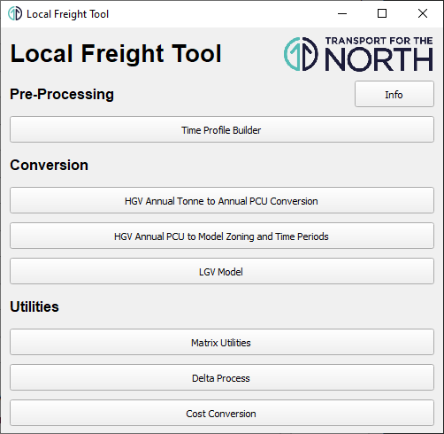

# Introduction

This document is provided as a user guide for installing and running the Local Freight Tool.
The Local Freight Tool provides a variety of functionality for developing HGV and LGV freight
demand matrices for model integration.

The document is split into the following sections:

- [Tool Location](#tool-location): describes where the Local Freight tool can be obtained from;
- [Installation](#installation): covers the requirements for the tool and how to install them;
- [Running Local Freight Tool](#running-local-freight-tool): covers information on how to run the tool; and
- [Tool Functionality](#tool-functionality): outlines all the functionality provided by the tool
  and provides information on how to run each module, including any required inputs and the
  expected outputs.

# Tool Location

The source code for the Local Freight tool is available on the [TfN-Freight-Tools](
  https://github.com/Transport-for-the-North/TfN-Freight-Tools) GitHub repository. For just running
the tool the required version can be selected by using the dropdown menu to select a branch then
clicking on the "Code" button and downloading the zip file. In order to edit the tool the GitHub
repository should be cloned, see [GitHub guide about remote repositories](
  https://docs.github.com/en/github/getting-started-with-github/about-remote-repositories).

Once the zip file has been downloaded it should be unzipped to the local machine then the
requirements should be installed using the instructions in the [Installation section](#installation).
When all the requirements are installed the Local Freight tool can be run following the steps
outlined in the [Running section](#running-local-freight-tool).

# Installation

Installation of the Local Freight Tool requires Anaconda (or Miniconda) to be installed, which
can be downloaded from [Anaconda.org](https://www.anaconda.com/products/individual#Downloads)
(or [Miniconda's website](https://docs.conda.io/en/latest/miniconda.html)). Once Anaconda has
been installed it can be used to install the Python requirements (listed in
[Packages Required](#packages-required) section) for running the tool.

## Creating conda Environment

A batch file has been supplied with the tool which will automatically install all the
Python requirements, this is called `install_tool.bat` and is found within the local_freight_tool
folder. Run `install_tool.bat` by double-clicking on it, if this is unsuccessful the requirements
can be installed with the following steps:

- Open Anaconda Prompt, accessible from Start Menu or Windows search, and navigate to the
  local_freight_tool directory.
- Create a new conda environment with `conda env create -f environment.yml`, use `y` to proceed
  if required.

## Packages required

The Python packages required by the Local Freight Tool are as follows (detailed version
information can be found in [environment.yml](environment.yml) which is provided with the
Python files):

- PyQT;
- Pandas;
- Openpyxl;
- markdown;
- jinja2;
- packaging; and
- pyyaml.

# Running Local Freight Tool

Another batch file has been created to simplify the steps for running the tool, this file is
called `run_tool.bat` and can be found with the Python files in the local_freight_tool folder.
The tool can be launched by double clicking on `run_tool.bat`, if this is unsuccessful then it
can be launched with the following steps:

- Use Anaconda Prompt to navigate to the local_freight_tool directory;
- Activate the conda environment using `conda activate freighttool`; and
- Launch the menu using `python -m LFT`.

*Tip: start writing the file name and press tab, the command prompt will autocomplete it for you.
For more information on the command prompt see [Command Prompt cheat sheet](
  http://www.cs.columbia.edu/~sedwards/classes/2017/1102-spring/Command%20Prompt%20Cheatsheet.pdf).*

## CAF Space

Some of the modules within LFT require zone correspondence files as inputs to translate between
zoning systems. The recommended method for creating these is using TfN's
[caf.space](https://github.com/Transport-for-the-North/caf.space) Python package. CAF space is
available on PyPi and can be installed with `pip install caf.space`.

CAF Space provides functionality for generating standard weighting translations in .csv format
describing how to convert between different zoning systems. The default output format of CAF space
is the correct format for any zone correspondence files required within LFT

# Tool Functionality

This section outlines the functionality provided in the tool, this functionality is split across
a number of modules which can be accessed from the main menu. The main menu of the tool is shown
in the image below, it is split into the following three sections:

- Pre-Processing: this section contains functionality for getting time period inputs ready
  for the HGV conversion processes.
- Conversion: this sections provides the main modules for producing HGV and LGV demand matrices.
- Utilities: this section contains a variety of utility functions that can perform many matrix
  calculations, demand forecasting and cost conversion.

## Time Profile Builder

This module is used to produce the time profile selection to be used as an input in the
[HGV Annual PCU to Model Time Period PCU](#hgv-annual-pcu-to-model-time-period-pcu) conversion. It
enables the user to set up to seven different time profiles, including the name of the profile,
days to use, the time period start and end hours, and the months. The months selected are used for
all time profiles. The profile builder menu is shown below.

The user is expected to enter a name for the time period selection. The days and time periods have
default values which can be changed by selecting the relevant checkboxes and drop down menus. To
create the selected profiles, the user must click 'Save Selection'. A warning appears when the time
periods selected do not add up to 24 hours. The output is summarised in the table below.

Table: Time Profile Builder output

| Name              | Type | Columns  | Description                                                        |
| ----------------- | ---- | -------- | ------------------------------------------------------------------ |
|                   |      | name     | Name of the time profile                                           |
|                   |      | days     | Days of the week in time profile.                                  |
| Profile_Selection | CSV  | hr_start | Start hour of time profile                                         |
|                   |      | hr_end   | End hour of time profile                                           |
|                   |      | months   | Months for all time profiles (this column is the same in all rows) |

## HGV Annual Tonne to Annual PCU Conversion

The HGV Annual Tonne to Annual PCU Conversion module enables the split and conversion of GBFM HGV
annual tonnage matrices into rigid and articulated annual PCU matrices. The interface is shown below.

The conversion and splitting process is based on the specification proposed by Ian Williams in the
technical note "Separating Rigid from Artic HGVs"[^separating_rigid_artic]. The process is detailed
in the flowchart below.

[^separating_rigid_artic]: Ian Williams. 035 Separating Rigid from Artic HGVs, v1.0. February 2021.

The inputs and outputs of the process are outlined in the following tables.

Table: Inputs for HGV annual tonne to annual PCU conversion module

| Input                                          | Type | Description                                                                                                                                              | Required columns                                                                           | Required rows                                                                         |
| ---------------------------------------------- | ---- | -------------------------------------------------------------------------------------------------------------------------------------------------------- | ------------------------------------------------------------------------------------------ | ------------------------------------------------------------------------------------- |
| Domestic and bulk port matrix                  | CSV  | Base year domestic and bulk-port traffic                                                                                                                 | Origin, destination, trips, column names are optional but columns must be in correct order | N/A                                                                                   |
| Unitised EU imports matrix                     | CSV  | Annual imported tonnes from GB ports to inland GBFM zones for unitised (non-bulk) trade to GB from European countries (including the island of Ireland)  | Origin, destination, trips, column names are optional but columns must be in correct order | N/A                                                                                   |
| Unitised EU exports matrix                     | CSV  | Annual exported tonnes from inland GBFM zones to GB ports for unitised (non-bulk) trade from GB to European countries (including the island of Ireland); | Origin, destination, trips, column names are optional but columns must be in correct order | N/A                                                                                   |
| Unitised non-EU imports and exports matrix     | CSV  | Annual tonnes between GB ports and inland GBFM zones for unitised (non-bulk) trade between GB and non-European countries                                 | "Imp0Exp1", "GBPortctr", "GBRawZone", "Traffic"                                            | N/A                                                                                   |
| Ports lookup                                   | CSV  | Shows lookup between GBPortctr and GBFM zones                                                                                                            | "GBPortctr", "GBZone"                                                                      | All ports in the unitised non-EU imports and exports matrix                           |
| Vehicle trips per 1000 tonnes by distance band | CSV  | Artic/rigid factors to apply for each trip distance per 1000 tonnes                                                                                      | "start", "end", "rigid", "artic"                                                           | N/A                                                                                   |
| GBFM distance matrix                           | CSV  | GBFM distance skim                                                                                                                                       | Origin, destination, trips, column names are optional but columns must be in correct order | All GBFM zones in domestic and bulk port matrix                                       |
| Port traffic trips per 1000 tonnes file        | CSV  | Articulated and rigid port traffic trip factors                                                                                                          | "type", "direction", "accompanied", "artic", "rigid"                                       | Factors for bulk traffic in both directions, and unitised traffic import and exports. |
| PCU factors                                    | CSV  | Articulated and rigid tonne to PCU factors to apply                                                                                                      | "zone", "direction", "artic", "rigid"                                                      | Row with default artic and rigid values                                               |

Table: Outputs for HGV annual tonne to annual PCU conversion module

| Output                  | Type | Description                                                                                                                                                                                                                                                                                                                                                                                                                                                                                                                                                                                                                           |
| ----------------------- | ---- | ------------------------------------------------------------------------------------------------------------------------------------------------------------------------------------------------------------------------------------------------------------------------------------------------------------------------------------------------------------------------------------------------------------------------------------------------------------------------------------------------------------------------------------------------------------------------------------------------------------------------------------- |
| artic_total_annual_pcus | CSV  | Annual articulated PCUs csv with columns "origin", "destination" and "trips"                                                                                                                                                                                                                                                                                                                                                                                                                                                                                                                                                          |
| rigid_total_annual_pcus | CSV  | Annual rigid PCUs csv with columns "origin", "destination" and "trips"                                                                                                                                                                                                                                                                                                                                                                                                                                                                                                                                                                |
| Tonne_to_pcu_log        | XLSX | Log of the process, containing a list of inputs provided, processes completed, errors if they occurred, and a summary of matrix statistics. Contains the following sheets: - `process`: indicates which processes completed and any errors that occurred; - `inputs`: a list of all the input files - `matrix_summaries`: summaries of the four input HGV matrices, the rigid and articulated total annual trip matrices, and the rigid and articulated total annual PCU matrices - `distance_bands`: the distance bands used - `port_traffic`: the port traffic factors used - `pcu_factors`: the PCU factors used |

## HGV Annual PCU to Model Time Period PCU

This module converts the articulated and rigid matrices (created by [HGV Annual Tonne to
Annual PCU Conversion](#hgv-annual-tonne-to-annual-pcu-conversion) from annual PCUs to model time
period PCUs, based on the time periods defined by [Time Profile Builder](#time-profile-builder).

This process requires the annual PCU matrices and time period information as inputs (more details
in the inputs table below) and produces the time period articulated, rigid and combined matrices
as well as a log spreadsheet summarising the process (more details in the outputs table below). The
log spreadsheet provides a summary of the calculations and the output matrices, **these tables
should all be checked in detail before using the outputs**, in order to assist with checking the
matrix summaries have been highlighted red or green to outline where more detailed checks are needed.

***Note:** Even if the matrix summaries are all highlighted green some manual checks should still be
undertaken to make sure the outputs have been checked to an appropriate level depending on the use
case.*

Table: Inputs for the HGV annual PCU to model time period PCU module

| Input                          |      Type      | Description                                                                                                                                                                                                                                                                                                                                                                                                                                                                                                                                                                                    |
| :----------------------------- | :------------: | :--------------------------------------------------------------------------------------------------------------------------------------------------------------------------------------------------------------------------------------------------------------------------------------------------------------------------------------------------------------------------------------------------------------------------------------------------------------------------------------------------------------------------------------------------------------------------------------------- |
| HGV Distributions              | Excel Workbook | Spreadsheet containing the DfT road traffic statistics (TRA) tables required for calculating the time period factors, should contain the following sheets: - TRA3105: the HGV road type distributions with columns Road Type, Rigid, Articulated and All HGVs; - TRA0305: the monthly distributions for HGV and road types with columns Road Type, Month and HGV; and - WEEKLY PROFILE: weekly distributions for articulated and rigid should contain columns Road Type, Time and an articulated and rigid column for each day.  *This spreadsheet is available on TfN's U drive.* |
| Time Periods Profiles          |      CSV       | Time period definitions file, created by module 2, should contain the following columns: - name: the name of the time period (used when labelling output matrices); - days list of the selected days as numbers (0 - 6) e.g. [0, 1, 2, 3, 4] for all weekdays; - hr_start: the starting hour of the time period, should be a number (0 - 23 inclusive); - hr_end: the ending hour of the time period, should be a number (0 - 23 inclusive); and - months: the month number (0 - 11 inclusive) as a list e.g. [0, 1, 3] to select January, February and April.                  |
| Model Year                     |    Integer     | Base year of the model, used for calculating the average number of weeks in a month during the time period conversions.                                                                                                                                                                                                                                                                                                                                                                                                                                                                        |
| Articulated Annual PCUs Matrix |      CSV       | Annual PCU matrix for the articulated HGVs created by module 4, should contain the following columns: origin, destination and trips, column names are optional but columns must be in correct order.                                                                                                                                                                                                                                                                                                                                                                                           |
| Rigid Annual PCUs Matrix       |      CSV       | Annual PCU matrix for the rigid HGVs created by module 4, should contain the following columns: origin, destination and trips, column names are optional but columns must be in correct order.                                                                                                                                                                                                                                                                                                                                                                                                 |
| Output Folder                  |      Text      | Path to the existing folder to save the outputs to.                                                                                                                                                                                                                                                                                                                                                                                                                                                                                                                                            |

Table: Outputs from the HGV annual PCU to model time period PCU module

| Output                                                                           |      Type      | Description                                                                                                                                                                                                                                                                                                                                                                                                                                                                                                                                                                                                             |
| :------------------------------------------------------------------------------- | :------------: | :---------------------------------------------------------------------------------------------------------------------------------------------------------------------------------------------------------------------------------------------------------------------------------------------------------------------------------------------------------------------------------------------------------------------------------------------------------------------------------------------------------------------------------------------------------------------------------------------------------------------- |
| `time_period_conversion_log`                                                     | Excel Workbook | Spreadsheet summarising the inputs, intermediary steps and statistics for the output matrices, contains the following sheets: - Notes: brief description of spreadsheet; - Input Parameters: list of all the input parameters provided; - Monthly Avg Profile: weighted average monthly HGV distribution; - Weekly Avg Profile: weighted average weekly (and hourly) HGV distribution; - Time Period Factors: summary of the input time periods and the calculated factors for each; and - Matrix Summaries: summary statistics for each of the output matrices, highlighted to assist with checking. |
| `{time period}_intermediate/{time period}_HGV_artic-{original zone system name}` |      CSV       | Time period PCUs matrix for articulated HGVs **before** rezoning to new zone system, contains origin, destination and trips columns.                                                                                                                                                                                                                                                                                                                                                                                                                                                                                    |
| `{time period}_intermediate/{time period}_HGV_artic-{rezoned zone system name}`  |      CSV       | Time period PCUs matrix for articulated HGVs **after** rezoning to new zone system, contains origin, destination and trips columns.                                                                                                                                                                                                                                                                                                                                                                                                                                                                                     |
| `{time period}_intermediate/{time period}_HGV_rigid-{original zone system name}` |      CSV       | Time period PCUs matrix for rigid HGVs **before** rezoning to new zone system, contains origin, destination and trips columns.                                                                                                                                                                                                                                                                                                                                                                                                                                                                                          |
| `{time period}_intermediate/{time period}_HGV_rigid-{rezoned zone system name}`  |      CSV       | Time period PCUs matrix for rigid HGVs **after** rezoning to new zone system, contains origin, destination and trips columns.                                                                                                                                                                                                                                                                                                                                                                                                                                                                                           |
| `{time period}_HGV_combined-{rezoned zone system name}`                          |      CSV       | Time period PCUs matrix for **both vehicle types** (articulated + rigid) **after** rezoning to the new zone system, contains origin, destination and trips columns.                                                                                                                                                                                                                                                                                                                                                                                                                                                     |

## LGV Model

LGV model moved to [caf.van](https://github.com/Transport-for-the-North/caf.van).

## Matrix Utilities

The matrix utilities module provides functionality for a variety of different operations which can
be applied to an O-D matrix CSV file. This functionality has been developed to be extremely
flexible and as such any number of operations can be turned off or on and the inputs can be any CSV
O-D matrix containing 3 columns, see inputs table for more details. This module has not been
created to process demand matrices in a specific way, the processing stages are determined entirely
by what is selected, the other modules in this tool provide more specific processing stages for
converting GBFM data to time period specific matrices. The operations provided by this module are as
follows:

- Summary: this will provide summary statistics for the input matrix such as matrix total, average
  value, number of zeros etc.
- Rezoning: this will convert the input matrix to a new zone system when given a zone
  correspondence lookup (this can be produced by module 1).
- Matrix addition: this will add a second matrix onto the matrix from the previous step and will
  set any negative values in the output matrix to 0.
- Matrix factoring: this will multiply the matrix (from the previous step) with another matrix
  (element wise) or with a global factor; only positive factors can be applied to stop the output
  becoming negative. The factor matrix does not need to include all O-D pairs present in the input
  matrix, any which aren't given will be factored by 1 i.e. not changed from the input.
- Fill missing zones: this will add any missing zones, which are provided as input, to the matrix
  and set their value to 0.
- Remove EE trips: this will set all external-external trips to 0 when given a list of external
  zones. If a more specific subset of EE trips is needed to be removed then matrix factoring can
  be used with a CSV containing all OD pairs for removal with factors of 0.
- Convert to UFM: this will convert the matrix to a UFM file, **requires SATURN to be installed**.

***Note:** All the above operations are applied one after another in the order above, so the output
from the previous operation becomes the input matrix for the next operation. For example if
rezoning, matrix factoring and convert to UFM are selected then the input matrix will be rezoned
and then the rezoned matrix will be multiplied by the given factor to produce an output, this
output will then be converted to a UFM.*

The menu for this module is shown above (any greyed out boxes aren't required until that process is
selected) and the inputs are listed in the table below, once these have been filled in the "Run"
button can be clicked to start the process. The process runs through the matrix operations in the
order they appear in the interface and will save any outputs to the folder given, any number or
combination of operations may be selected in order to process a matrix file in whatever way is
desired. The output files produced depends upon what operations are selected but a list of all
possible outputs is outlined in the table below.

Table: Inputs for matrix utilities module

| Input              |         Type         | Optional | Description                                                                                                                                                                                                                                                                                                                                                                                                                                                                               |
| ------------------ | :------------------: | :------: | ----------------------------------------------------------------------------------------------------------------------------------------------------------------------------------------------------------------------------------------------------------------------------------------------------------------------------------------------------------------------------------------------------------------------------------------------------------------------------------------- |
| Input matrix       |         CSV          |    No    | O-D matrix CSV with the following 3 columns: origin, destination and trips. Column names are optional but they must be in the correct order.                                                                                                                                                                                                                                                                                                                                              |
| Summary            |       Boolean        |   Yes    | When checked produces spreadsheet which provides summary statistics about the matrix at each stage of the process. Recommend to leave turned on as the summary is useful when checking the outputs.                                                                                                                                                                                                                                                                                       |
| Rezoning           |         CSV          |   Yes    | Zone correspondence lookup file to be used to rezone the input matrix to a new zone system, can be produced with the zone correspondence module, expected columns: zone_1_id, zone_2_id, factor (names are optional but must be in the correct order). If rezoning is turned on then the input matrix will be rezoned before any other processing stages are ran, therefore **any other inputs used further down should be in the zone system that the matrix is being converted to.**    |
| Matrix addition    |         CSV          |   Yes    | Another O-D matrix CSV, expected columns: origin, destination and value (names are optional but columns must be in the correct order). This matrix will be added to the matrix from the previous step, negative values in this matrix are allowed but any negative values in the output are set to 0.                                                                                                                                                                                     |
| Matrix factoring   |     CSV or Real      |   Yes    | Another O-D matrix CSV (or global factor), expected columns: origin, destination and value (names are optional but columns must be in the correct order). This matrix (or global factor) will be multiplied with the matrix from the previous step. Only positive factors can be applied, if a matrix is given then all cells must be positive or the process will stop. **Any O-D pairs present in the input matrix but not in the factor matrix will be factored by 1 i.e. no change.** |
| Fill missing zones | CSV or list of zones |   Yes    | CSV containing single column (or comma-separated list) of missing zones which will be added to the matrix from the previous step with a value of 0.                                                                                                                                                                                                                                                                                                                                       |
| Remove EE trips    | CSV or list of zones |   Yes    | CSV containing single column (or comma-separated list) of all zones, in the matrix from the previous step, which will have trips set to 0. If a more specific subset of EE trips is needed to be removed then matrix factoring can be used.                                                                                                                                                                                                                                               |
| Convert to UFM     |        Folder        |   Yes    | Path to the SATURN exes folder, if selected will convert the matrix (from the previous step) to a UFM file.                                                                                                                                                                                                                                                                                                                                                                               |
| Output folder      |        Folder        |    No    | Directory where all the output matrices and the summary will be saved.                                                                                                                                                                                                                                                                                                                                                                                                                    |

Table: Outputs from matrix utilities module

| File                     | File Type      | Condition                                                                                   | Description                                                                                                                                                                                                                                                                                                                                                                                                                      |
| ------------------------ | -------------- | ------------------------------------------------------------------------------------------- | -------------------------------------------------------------------------------------------------------------------------------------------------------------------------------------------------------------------------------------------------------------------------------------------------------------------------------------------------------------------------------------------------------------------------------- |
| matrix_info              | Excel Workbook | Output when summary is turned on.                                                           | List of the inputs provided for each selected operation and a summary of matrix statistics at each stage of the process, contains the following sheets: - `inputs`: lists the provided inputs for each operation, information on if the operation succeeded and any error messages; and - `input_summary`: statistics for the matrix being processed at each stage.                                                        |
| {input matrix}_rezoned   | CSV            | Output if rezoning is selected.                                                             | The input matrix rezoned to the new zone system, contains the following columns: - `origin`: origin zone number in new zone system; - `destination`: destination zone number in new zone system; and - `trips`: for the OD pair.                                                                                                                                                                                        |
| {input matrix}_processed | CSV            | Output if any operations other than "Summary", "Rezoning" or "Convert to UFM" are selected. | The output matrix for any operations that have been selected, contains the following columns: - `origin`: origin zone number in new zone system; - `destination`: destination zone number in new zone system; and - `trips`: for the OD pair. This matrix is a combination of all the selected operations applied one after another and it's name contains information about the operations which have been applied. |
| {input matrix}           | UFM            | Output if "Convert to UFM" is selected.                                                     | SATURN UFM matrix created from the processed matrix.                                                                                                                                                                                                                                                                                                                                                                             |
| {input matrix}           | LPX            | Output if "Convert to UFM" is selected.                                                     | SATURN MX log file of the conversion from CSV to UFM.                                                                                                                                                                                                                                                                                                                                                                            |
| {input matrix}_VDU       | VDU            | Output if "Convert to UFM" is selected.                                                     | SATURN MX VDU file of the conversion from CSV to UFM.                                                                                                                                                                                                                                                                                                                                                                            |

## Delta Process

The Delta Process module provides the functionality for performing forecasting to calculate future
year model demand. The calculations implemented within this module follow the delta approach to
forecasting which calculates the growth in demand within the freight data and applies this growth
to the base model demand. The methodology used for this process, and the underlying formulae, is
described in the Delta Process methodology flowchart.

The user must provide the O-D matrices for the base year model assignment demand, the base year
freight demand and the forecast year freight demand; **all input matrices must be in the same zone
system and for the same time period.** In addition to the matrices the user must select from one of
two growth modes, standard or exceptional (see flowchart for information on the different modes),
and provide the weighting factors. The inputs table below provides more detailed information on
each input for this module.

The module will produce two outputs for the user, saved in the output folder, the first is a log
spreadsheet which outlines the inputs used and summarises the input and output matrices. The
second output is the forecast year demand matrix for the model, as a CSV file; the outputs table
below provides more information on all the files produced by the Delta Process.

Table: Inputs for the Delta Process module

| Input                                    |            Type             |  Default   | Description                                                                                                                                                                                                                                                        |
| :--------------------------------------- | :-------------------------: | :--------: | :----------------------------------------------------------------------------------------------------------------------------------------------------------------------------------------------------------------------------------------------------------------- |
| Model Assignment Demand - Base Year      |             CSV             |     -      | O-D matrix for the assignment model base year demand. Should contain the following 3 columns: origin, destination and trips; column names are optional but they must be in the correct order.                                                                      |
| Processed Freight Demand - Base Year     |             CSV             |     -      | O-D matrix for the processed freight base year demand, **must be in the same zone system as model assignment demand**. Should contain the following 3 columns: origin, destination and trips; column names are optional but they must be in the correct order.     |
| Processed Freight Demand - Forecast Year |             CSV             |     -      | O-D matrix for the processed freight forecast year demand, **must be in the same zone system as model assignment demand**. Should contain the following 3 columns: origin, destination and trips; column names are optional but they must be in the correct order. |
| Growth Mode                              | 'Standard' or 'Exceptional' | 'Standard' | Choice between two growth modes which can be undertaken with the Delta Process, see the methodology flowchart for more information about each calculation. **'Standard' mode is recommended.**                                                                     |
| Weighting Factor - $K_1$                 |         Real (> 0)          |    1.0     | Constant used in the 'Exceptional' growth calculations, not used for the 'Standard' growth mode, see the methodology flowchart for the formulae that use this constant. **Default value of 1.0 is recommended.**                                                   |
| Weighting Factor - $K_2$                 |         Real (> 0)          |    1.0     | Constant used in the 'Exceptional' growth calculations, not used for the 'Standard' growth mode, see the methodology flowchart for the formulae that use this constant. **Default value of 1.0 is recommended.**                                                   |
| Output Folder                            |       Path to Folder        |     -      | Path to the folder where the output files will be saved.                                                                                                                                                                                                           |

Table: Outputs from the Delta Process module

| File                                  |      Type      | Description                                                                                                                                                                                                                                                                                                                         |
| :------------------------------------ | :------------: | :---------------------------------------------------------------------------------------------------------------------------------------------------------------------------------------------------------------------------------------------------------------------------------------------------------------------------------- |
| `forecast_log`                        | Excel Workbook | Lists all the inputs provided, summarises the outputs and provides a log of the process, contains the following sheets: - `inputs`: list of all the input parameters; - `matrix_summaries`: provides summary statistics for the input and output matrices; and - `process`: logs any errors that occur during the process. |
| `model_forecast_demand_[growth_mode]` |      CSV       | O-D matrix for the assignment model forecast year demand, contains the following columns: - `origin`: origin zone number; - `destination`: destination zone number; and - `trips`: forecasted trips for the OD pair.                                                                                                       |

## Cost Conversion

This module uses a the zone correspondence produced with [CAF Space](#caf-space)
to perform a demand-weighted conversion of costs in O-D format to the new zoning system. The
interface is shown below.

All O-D matrices chosen must contain three columns only, with a header row that is of the form
'origin', 'destination' and 'trips' (or a cost attribute where applicable).

The user must select an O-D cost matrix file to convert, an O-D trip matrix file for the weighting,
the zone correspondence file produced in module 1, and an output directory. Once 'Run' is clicked, a
progress window displays the cost conversion process. Once completed, the cost CSV in the new zoning
system is saved to the output directory under the name 'Output_Cost_Converted'.

