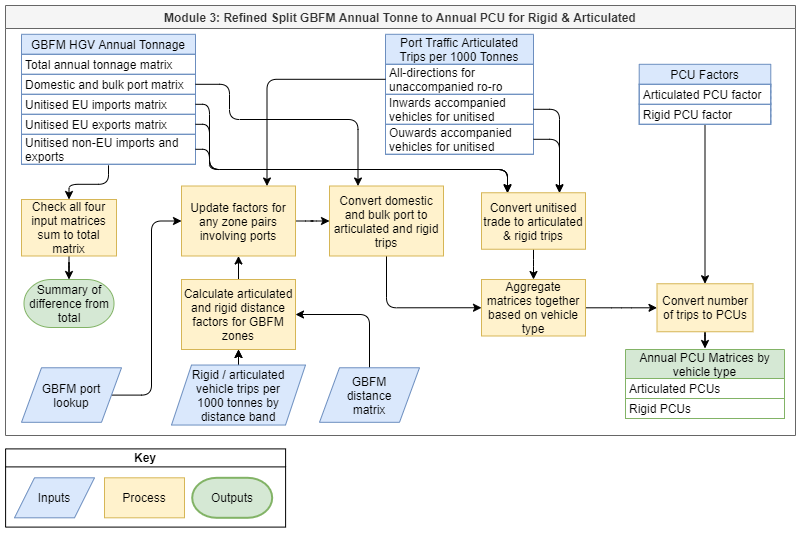

# Introduction
This document is provided as a user guide for installing and running the Local Freight Tool.
The Local Freight Tool provides a variety of functionality for developing HGV and LGV freight
demand matrices for model integration.

The document is split into the following sections:

- [Installation](#installation): covers the requirements for the tool and how to install them;
- [Running Local Freight Tool](#running-local-freight-tool): covers information on how the tool
  is ran; and
- [Tool Functionality](#tool-functionality): outlines all the functionality provided by the tool
  and provides information on how to run each module, including any required inputs and the
  expected outputs.

# Installation
Installation of the Local Freight Tool requires Anaconda (or Miniconda) to be installed, which
can be downloaded from [Anaconda.org](https://www.anaconda.com/products/individual#Downloads)
(or [Miniconda's website](https://docs.conda.io/en/latest/miniconda.html)). Once Anaconda has
been installed it can be used to install are the Python requirements (listed in
[Packages Required](#packages-required) section) for running the tool, details in the following
section.

## Creating conda Environment
A batch file has been supplied with the tool which will automatically install all the
Python requirements, this is called `install_tool.bat` and is found within the local_freight_tool
folder. Run `install_tool.bat` by double-clicking on it, if this is unsuccessful the requirements
can be installed with the following steps:

- Open Anaconda Prompt, accessible from Start Menu or Windows search, and navigate to the
  local_freight_tool directory.
- Create a new conda environment with `conda env create -f environment.yml`, use `y` to proceed
  if required.

## Packages required
The Python packages required by the Local Freight Tool are as follows (detailed version
information can be found in [environment.yml](environment.yml) which is provided with the
Python files):

- PyQT;
- Pandas;
- GeoPandas; and
- Openpyxl.

# Running Local Freight Tool
Another batch file has been created to simplify the steps for running the tool, this file is
called `run_tool.bat` and can be found with the Python files in the local_freight_tool folder.
The tool can be launched by double clicking on `run_tool.bat`, if this is unsuccessful then it
can be launched with the following steps:

- Use Anaconda Prompt to navigate to the local_freight_tool directory;
- Activate the conda environment using `conda activate freighttool`; and
- Launch the menu using `python tc_main_meny.py`.

*Tip: start writing the file name and press tab, the command prompt will autocomplete it for you.
For more information on the command prompt see [Command Prompt cheat sheet](http://www.cs.columbia.edu/~sedwards/classes/2017/1102-spring/Command%20Prompt%20Cheatsheet.pdf).*

# Tool Functionality
This section outlines the functionality provided in the tool, this functionality is split across
a number of modules which can be accessed from the main menu. The main menu of the tool is shown
in the image below, it is split into the following three sections:

<!-- TODO: Update this section once the final modules have been finished -->
- Pre-Processing: this section contains a variety of modules for getting inputs ready for the
  conversion processes.
- Conversion: this sections provides the main modules for producing HGV and LGV demand matrices.
- Utilities: this section contains a variety of utility functions that can perform many matrix
  calculations, demand forecasting and cost conversion.

## 0: Combine Centroid and Polygon Shapefiles
This module provides functionality to combine two shapefiles together where one contains points
and the other contains polygons, this is to allow the GBFM zone system shapefiles to be combined
together into a single file for use in module 1: Produce Zone Correspondence. The GBFM zone
system is provided as one polygon shapefile which doesn't contain all the zones and a point
(centroids) shapefile which contains all zones.

The menu for this module is shown above and the inputs are listed in the table below, once these
have been filled in the "Run" button can be clicked to start the process. The process runs through
the following steps to produce the outputs (see outputs table below):

- Find any zones present in the centroids shapefile which aren't present in the polygons, the zone
  IDs are expected to be given in a column with the name "UniqueID" in both shapefiles. If no zones
  are present in the centroids shapefile which aren't already in the polygon shapefile then the
  process stops here and no output is created.
- Create a buffer around all centroids found to change these to polygon shapes, buffer radius can
  be provided in the interface.
- Finally, the newly created polygons (from the centroids shapefile) are combined with all other
  polygons (from the polygon shapefile) to produce the output combined shapefile.

The output provided by this process can then be given to module 1 in order to create a
correspondence between two zone systems. This module has been developed to be flexible so that it
will work with any pair of polygon and point shapefiles as long as they both contain a "UniqueID"
column.

Table: Inputs for Combine Centroid and Polygon Shapefiles module

| Input                      |       Type        | Optional | Default | Description                                                                                      |
| -------------------------- | :---------------: | :------: | :-----: | ------------------------------------------------------------------------------------------------ |
| Polygon shapefile          |       .shp        |    No    |    -    | The shapefile containing all the polygon zones, **must contain a column named "UniqueID"**.      |
| Centroid (point) shapefile |       .shp        |    No    |    -    | The shapefile containing the centroids of all zones, **must contain a column named "UniqueID"**. |
| Output directory           |      Folder       |    No    |    -    | The folder where the output shapefile will be saved.                                             |
| Buffer radius              | Real (0.01 - 10m) |    No    |  1.00m  | The radius of the circle (in metres) around the centroid point, created for the output file.     |

Table: Outputs from Combine Centroid and Polygon Shapefiles module

| File                                | File Type | Description                                                                                                                                                                                                                                                                              |
| ----------------------------------- | :-------: | ---------------------------------------------------------------------------------------------------------------------------------------------------------------------------------------------------------------------------------------------------------------------------------------- |
| `{polygon_shapefile_name}-combined` |   .shp    | Polygon shapefile containing all the information from the input polygon shapefile plus circular representations of any zones from the centroids shapefile. This file includes any information available from the centroid shapefile with the same column names as the polygon shapefile. |

## 1: Produce Zone Correspondence
This module is used to build a zone correspondence lookup between two shapefiles, flexibility of
this module allows it to create a lookup between any two polygon shapefiles containing zones
(assuming they follow the correct format). However the primary purpose of this module is to
produce a lookup between the GBFM and NoHAM zone systems to be used when creating the model demand
matrices in later modules of the Local Freight Tool.

The inputs for this module are outlined in the table below, some of which are optional depending if
point handling or rounding are turned on. Once inputs are filled in "Run" can be clicked to start
the process and a progress window will pop up to alert you at what stage the process is at and
will provide information on any issues with the inputs that have been found. The outputs for
the process are defined in the table below and should be checked thoroughly before the lookup
is used for anything, the `zone_correspondence_log` provides more information on specific areas
which will need detailed checking.

The zone correspondence process takes the two input shapefiles and performs spatial analysis to
calculate the overlap percentages between the two zone systems in order to determine the
correspondence (see [Zone Correspondence Calculations](#zone-correspondence-calculations) for more
detail). These overlaps will be used as the spatial splitting factors but two additional options
are provided to produce a more robust correspondence, these are as follows:

- Rounding: this option will use the tolerance value to filter out any slithers (see
  [Zone Correspondence Calculations](#zone-correspondence-calculations) for more details) and will
  round all remaining splitting factors to make sure that each zone from the first zone system has
  splitting factors with the second zone system which sum to exactly 1. This method will stop any
  demand being lost when using the lookup to convert from the first to the second zone system
  (**recommend having this turned on**).
- Point handling: this option will use the LSOA data and shapefile to determine the splitting
  factors for point zones in the second zone system, instead of just using the spatial factors
  (see [Zone Correspondence Calculations](#zone-correspondence-calculations) for more details).
  Point zones are defined as small zones which are expected to have more demand than there size
  would suggest, e.g. ports or distribution centres, these can be given to the tool as a list of
  zone IDs (**recommended method**) or can be calculated by the tool based on the point tolerance.

Table: Zone correspondence inputs

| Input                              |      Type      | Condition                            | Optional | Default | Description                                                                                                                                                                                                             |
| ---------------------------------- | :------------: | ------------------------------------ | :------: | :-----: | ----------------------------------------------------------------------------------------------------------------------------------------------------------------------------------------------------------------------- |
| Zone 1 name                        |     String     | -                                    |   Yes    |  gbfm   | Name of zoning system to be converted from.                                                                                                                                                                             |
| Zone 2 name                        |     String     | -                                    |   Yes    |  noham  | Name of zoning system to convert to.                                                                                                                                                                                    |
| First zone system                  |      .shp      | -                                    |    No    |    -    | Zoning system shapefile to be converted from, zone ID column should be called "UniqueID".                                                                                                                               |
| Second zone system                 |      .shp      | -                                    |    No    |    -    | Zoning system shapefile to convert to, zone ID column should be called "unique_id".                                                                                                                                     |
| Output directory                   |   Directory    | -                                    |    No    |    -    | Directory where output files will be saved.                                                                                                                                                                             |
| Rounding                           |    Checkbox    | -                                    |   Yes    |   On    | Turns on rounding option (**recommend having this turned on**), see above for more details on this option.                                                                                                              |
| Tolerance                          |      Real      | Point handling or rounding turned on |    No    |  98.0%  | Tolerance used to filter out small overlaps between zones, changing this value will affect how much overlap is needed for zones to be kept in the correspondence (98% is recommended for GBFM to NoHAM correspondence). |
| Point handling                     |    Checkbox    | -                                    |   Yes    |   On    | Turns on point handling option, see above for more details on this option.                                                                                                                                              |
| Point tolerance                    |    Integer     | Point handling turned on             |    No    |   95%   | Tolerance used to find point zones in second zone system when no point zone list is specified.                                                                                                                          |
| Second zone system point zone list | .csv or String | Point handling turned on             |   Yes    |    -    | List of point zones in the second zoning system (e.g. NoHAM). Must be a csv with "zone_id" column name. If unspecified, then the point tolerance is used to find the point zones.                                       |
| LSOA data                          |      .csv      | Point handling turned on             |    No    |    -    | CSV containing LSOA data (such as employment) to perform non-spatial point zone handling. The file must have the LSOA zone IDs in the "lsoa11cd" column and the relevant data in the "var" column.                      |
| LSOA shapefile                     |      .csv      | Point handling turned on             |    No    |    -    | LSOA shapefile, with zone IDs in "LSOA11CD" column.                                                                                                                                                                     |

Table: Zone correspondence outputs

| File                                                 | File Type             | Description                                                                                                                                                                                                                                                                                                                                                                                                                                                                                                                                                                                                    |
| ---------------------------------------------------- | --------------------- | -------------------------------------------------------------------------------------------------------------------------------------------------------------------------------------------------------------------------------------------------------------------------------------------------------------------------------------------------------------------------------------------------------------------------------------------------------------------------------------------------------------------------------------------------------------------------------------------------------------- |
| `{zone_1}_to_{zone_2}` `_spatial_correspondence.csv` | Comma-separate values | Spatial correspondence with no rounding or point handling, includes adjustment factors for converting from zone system 1 to zone system 2 and vice versa. **This file is provided for checking only, use zone correspondence output (below) for any rezoning.** Contains the following 4 columns: - `{zone_1}_zone_id`: zone ID for first zone system - `{zone_2}_zone_id`: zone ID for corresponding zone in second zone system - `{zone_1}_to_{zone_2}`: spatial splitting factor to go from zone system 1 to 2 - `{zone_2}_to_{zone_1}`: spatial splitting factor to go from zone system 2 to 1 |
| `{zone_1}_to_{zone_2}` `_zone_correspondence.csv`    | Comma-separate values | Zone correspondence with all rounding and point handling options applied (if selected), in the correct format for use in the other modules of the tool. Contains the following 3 columns: - `{zone_1}_zone_id`: zone ID for the first zone system - `{zone_2}_zone_id`: zone ID for the corresponding zone in the second zone system - `{zone_1}_to_{zone_2}`: splitting factor to go from zone system 1 to 2                                                                                                                                                                                         |
| `zone_correspondence_log.xlsx`                       | Excel Workbook        | Spreadsheet containing results from the checks performed by the tool, **this file should be checked thoroughly before using the zone correspondence output**. Contains the following 4 worksheets: - `Parameters`: list of input parameters and their selected values - `{zone_1}_missing`: list of zone system 1 zones missing from zone correspondence - `{zone_2}_missing`: list of zone system 2 zones missing from zone correspondence - `point_handling`: if point handling was on, this lists all the zones affected by point zone handling                                                 |

### Zone Correspondence Calculations
This section provides the technical calculations performed by the zone correspondence process to
produce the lookup between the two zone systems.

<!-- Note: GitHub doesn't render markdown equations -->

#### Spatial Correspondence
The spatial correspondence adjustment factors are defined as:

$$
F_{spatial}(Z_{1i} \rightarrow Z_{2j}) = \frac{A(Z_{1i} \cap Z_{2j})}{A(Z_{1i})}
$$

where:

- $Z_{1i}$ is zone i in the first zone system (usually GBFM);
- $Z_{2j}$ is zone j in the second zone system (usually model);
- $A(Z_{1i} \cap Z_{2j})$ is the area of the intersection between the two zones; and
- $A(Z_{1i})$ is the area of zone i in the first zone system.

The GeoPandas overlay function is used to calculate the intersecting area of the zones; see
[GeoPandas documentation](https://geopandas.org/set_operations.html) for more details. If neither
rounding or point handling are selected then the spatial correspondence is the final correspondence.

#### Point Handling (optional)
Point handling affects the point zones in the second zone system and any other zones in that system
which share a correspondence with the same zone for the first zone system. A list of point zones
can be provided to the tool (recommended) but if not given then the tool will define them as any
zones which satisfy the following:

$$
F_{spatial}(Z_{1i} \rightarrow Z_{2j}) < 1 - T_{pt}
$$

$$
F_{spatial}(Z_{2j} \rightarrow Z_{1i}) > T_{pt}
$$

where $T_{pt}$ is the point tolerance. This method might miss some point zones, or include some
non-point zones, so it is recommended to **check the point handling sheet of the output log
spreadsheet.**

Point handling has been designed to use LSOA data for calculating the adjustment factor, however
the flexibility of the tool permits any data which satisfies the conditions outlined in the inputs
table. For point zone $Z_{2pt}$ and $\{Z_{2j}\}$, the set of zones which overlap with the same zone
$Z_{1k}$ from the first zone system, the non-spatial adjustment factors are given by:

$$
F_{non-spatial}(Z_{1k} \rightarrow Z_{2pt})
  = \left( F_{spatial}(Z_{1k} \rightarrow Z_{2pt}) + \sum_{j} F_{spatial}(Z_{1k} \rightarrow Z_{2j}) \right)
    \cdot \frac{V(L_{pt})}{\sum_n V(L_{n})}
$$

$$
F_{non-spatial}(Z_{1k} \rightarrow Z_{2m})
  = \left( F_{spatial}(Z_{1k} \rightarrow Z_{2pt}) + \sum_{j} F_{spatial}(Z_{1k} \rightarrow Z_{2j}) \right)
    \cdot \frac{\sum_l V(L_{l})}{\sum_n V(L_{n})}
$$

where:

- $Z_{2m} \in \{Z_{2j}\}$;
- $V(L_{pt})$ is the LSOA data (in var column) for $L_{pt}$;
- $L_{pt}$ is the LSOA which contains $Z_{2pt}$;
- $\{L_n\}$ is the set of LSOAs which overlap with $Z_{1k}$; and
- $\{L_l\}$ is the set of LSOAs which overlap with $Z_{2m}$, excluding $L_{pt}$.

##### Point Handling Example

In the above example:

$$
A(GBFM_1 \cap NoHAM_{pt}) + A(GBFM_1 \cap NoHAM_1) = A(GBFM_1)
$$

so:

$$
F_{non-spatial}(GBFM_1 \rightarrow NoHAM_{pt}) = \frac{V(LSOA_4)}{\sum_{n=1}^6 V(LSOA_n)}
$$

$$
F_{non-spatial}(GBFM_1 \rightarrow NoHAM_1) = \frac{\sum_{l=1,l \ne 4}^6 V(LSOA_l)}{\sum_{n=1}^6 V(LSOA_n)}
$$

#### Rounding (optional)
When rounding or point handling is turned on, small overlaps (slithers) these are defined as
satisfying the following:

$$
F_{spatial}(Z_{1i} \rightarrow Z_{2j}) < 1 - T
$$

$$
F_{spatial}(Z_{2j} \rightarrow Z_{1i}) < 1 - T
$$

where $T$ is tolerance. If the above conditions are both satisfied then the row that features zone
i from the first zone system and zone j from the second is removed from the zone correspondence. If
rounding is off but point handling is on then these rows are removed for the point handling aspect
of the calculations then reinserted.

If only the first condition above is satisfied then the row is only removed if both zones in the
pairing are present elsewhere in the correspondence output. The reason both conditions are used is
because zones which have a large difference in size, between the two zone systems, could have a very
small overlap in one direction even if they are completely within the other zone, see example below.

When rounding is on, the tool will also check that the first zone system to second zone system
adjustment factors sum to 1 for all zones in the first zone system.

- If a zone in the first zone system maps to a single zone in the second (after removing slithers)
  the adjustment factor is set to 1.
- If a zone in the first zone system ($Z_{1i}$) maps to multiple zones in the second ($\{Z_{2j}\}$),
  and the sum of the adjustment factors is not 1, then it is adjusted according to:

$$
F_{adjusted}(Z_{1i} \rightarrow Z_{2k}) = F(Z_{1i} \rightarrow Z_{2k}) +
  \frac{1-\sum_{j=0}^n F(Z_{1i} \rightarrow Z_{2j})}{n}
$$

- where:
  - $Z_{2k} \in \{Z_{2j}\}$;
  - $n$ is the number of zones in $\{Z_{2j}\}$; and
  - $F(Z_{1i} \rightarrow Z_{2k})$ is the adjustment factor calculated prior to rounding, either
    spatially or non-spatially.

#### Missing Zones
At the end of the process the zone IDs present in the zone correspondence lookup are compared to
those in the input shapefiles and any missing ones are added to the log file. Missing zones are
due to no overlap being found between zones in the two zone systems. The missing zones sheet of
the zone correspondence log spreadsheet should be checked to find out where this has occurred and
these should be fixed by manually updating the input or outputs.

- The input zone system shapefiles could be updated to move the missing zones into a more sensible
  location where they overlap with the other zone system; or
- The output lookup could be manually updated to add in the correspondence for any missing zones
  based on the user's understanding of the two zone systems.

For the GBFM to NoHAM correspondence there are 62 reserve zones in the NoHAM zone system which do
not have a corresponding GBFM zone as they're in the middle of the sea. There are also some GBFM
zones which don't overlap with any NoHAM zones; these are on the coast, in rivers or in one case an
island with no NoHAM zone.

## 2: Time Profile Builder

## 3: HGV Annual Tonne to Annual PCU Conversion
The HGV Annual Tonne to Annual PCU Conversion module enables the split and conversion of GBFM HGV annual tonnage 
matrices into rigid and articulated PCU matrices. The conversion process is detailed in the flowchart below.

The inputs and outputs are outlined in the tables below.

Table: Inputs for HGV annual tonne to annual PCU conversion module

| Input                                          | Type       | Description                                                                                                                                              | Required columns                                                                           | Required rows                                                                         |
|------------------------------------------------|------------|----------------------------------------------------------------------------------------------------------------------------------------------------------|--------------------------------------------------------------------------------------------|---------------------------------------------------------------------------------------|
| Domestic and bulk port matrix                  | CSV        | Base year domestic and bulk-port traffic                                                                                                                 | Origin, destination, trips, column names are optional but columns must be in correct order | N/A                                                                                   |
| Unitised EU imports matrix                     | CSV        | Annual imported tonnes from GB ports to inland GBFM zones for unitised (non-bulk) trade to GB from European countries (including the island of Ireland)  | Origin, destination, trips, column names are optional but columns must be in correct order | N/A                                                                                   |
| Unitised EU exports matrix                     | CSV        | Annual exported tonnes from inland GBFM zones to GB ports for unitised (non-bulk) trade from GB to European countries (including the island of Ireland); | Origin, destination, trips, column names are optional but columns must be in correct order | N/A                                                                                   |
| Unitised non-EU imports and exports matrix     | CSV        | Annual tonnes between GB ports and inland GBFM zones for unitised (non-bulk) trade between GB and non-European countries                                 | “Imp0Exp1", "GBPortctr", "GBRawZone", "Traffic"                                            | N/A                                                                                   |
| Ports lookup                                   | CSV        | Shows lookup between GBPortctr and GBFM zones                                                                                                            | "GBPortctr", "GBZone"                                                                      | All ports in the unitised non-EU imports and exports matrix                           |
| Vehicle trips per 1000 tonnes by distance band | CSV        | Artic/rigid factors to apply for each trip distance per 1000 tonnes                                                                                      | "start", "end", "rigid", "artic"                                                           | N/A                                                                                   |
| GBFM distance matrix                           | CSV        | Average distance between each O-D pair                                                                                                                   | Origin, destination, trips, column names are optional but columns must be in correct order | All GBFM zones in domestic and bulk port matrix                                       |
| Port traffic trips per 1000 tonnes file        | CSV | Articulated and rigid port traffic trip factors                                                                                                                 | "type", "direction", "accompanied", "artic", "rigid"                                       | Factors for bulk traffic in both directions, and unitised traffic import and exports. |
| PCU factors                                    | CSV | Articulated and rigid tonne to PCU factors to apply                                                                                                             | "zone", "direction", "artic", "rigid"                                                      | Row with default artic and rigid values                                               |

Table: Outputs for HGV annual tonne to annual PCU conversion module

| Output                  | Type | Description                                                                                                                                                                                                                                                                                                                                                                                                                                                                                                                                                                                                                           |
|-------------------------|------|---------------------------------------------------------------------------------------------------------------------------------------------------------------------------------------------------------------------------------------------------------------------------------------------------------------------------------------------------------------------------------------------------------------------------------------------------------------------------------------------------------------------------------------------------------------------------------------------------------------------------------------|
| artic_total_annual_pcus | CSV  | Annual articulated PCUs csv with columns “origin”, “destination” and “trips”                                                                                                                                                                                                                                                                                                                                                                                                                                                                                                                                                          |
| rigid_total_annual_pcus | CSV  | Annual rigid PCUs csv with columns “origin”, “destination” and “trips”                                                                                                                                                                                                                                                                                                                                                                                                                                                                                                                                                                |
| tonne_to_pcu_log        | XLSX | Log of the process, containing a list of inputs provided, processes completed, errors if they occurred, and a summary of matrix statistics. Contains the following sheets: - `process`: indicates which processes completed and any errors that occurred; - `inputs`: a list of all the input files - `matrix_summaries`: summaries of the four input HGV matrices, the rigid and articulated total annual trip matrices, and the rigid and articulated total annual PCU matrices - `distance_bands`: the distance bands used - `port_traffic`: the port traffic factors used - `pcu_factors`: the PCU factors used |

## 4: GBFM Annual PCU to Model Time Period PCU

## 5: LGV Processing

## 6: Matrix Utilities
The matrix utilities module provides functionality for a variety of different operations which can
be applied to an O-D matrix CSV file. This functionality has been developed to be extremely
flexible and as such any number of operations can be turned off or on and the inputs can be any CSV
O-D matrix containing 3 columns, see inputs table for more details. This module has not been
created to process demand matrices in a specific way, the processing stages are determined entirely
by what is selected, the other modules in this tool provide more specific processing stages for
converting GBFM data to time period specific matrices. The operations provided by this module are as
follows:

- Summary: this will provide summary statistics for the input matrix such as matrix total, average
  value, number of zeros etc.
- Rezoning: this will convert the input matrix to a new zone system when given a zone
  correspondence lookup (this can be produced by module 1).
- Matrix addition: this will add a second matrix onto the matrix from the previous step and will
  set any negative values in the output matrix to 0.
- Matrix factoring: this will multiply the matrix (from the previous step) with another matrix
  (element wise) or with a global factor; only positive factors can be applied to stop the output
  becoming negative.
- Fill missing zones: this will add any missing zones, which are provided as input, to the matrix
  and set their value to 0.
- Remove EE trips: this will set all external-external trips to 0 when given a list of external
  zones.
- Convert to UFM: this will convert the matrix to a UFM file, **requires SATURN to be installed**.

***Note:** All the above operations are applied one after another in the order above, so the output
from the previous operation becomes the input matrix for the next operation. For example if
rezoning, matrix factoring and convert to UFM are selected then the input matrix will be rezoned
and then the rezoned matrix will be multiplied by the given factor to produce an output, this
output will then be converted to a UFM.*

The menu for this module is shown above (any greyed out boxes aren't required until that process is
selected) and the inputs are listed in the table below, once these have been filled in the "Run"
button can be clicked to start the process. The process runs through the matrix operations in the
order they appear in the interface and will save any outputs to the folder given, any number or
combination of operations may be selected in order to process a matrix file in whatever way is
desired. The output files produced depends upon what operations are selected but a list of all
possible outputs is outlined in the table below.

Table: Inputs for matrix utilities module

| Input              |         Type         | Optional | Description                                                                                                                                                                                                                                                                                                                                                                                                                                                                            |
| ------------------ | :------------------: | :------: | -------------------------------------------------------------------------------------------------------------------------------------------------------------------------------------------------------------------------------------------------------------------------------------------------------------------------------------------------------------------------------------------------------------------------------------------------------------------------------------- |
| Input matrix       |         CSV          |    No    | O-D matrix CSV with the following 3 columns: origin, destination and trips. Column names are optional but they must be in the correct order.                                                                                                                                                                                                                                                                                                                                           |
| Summary            |       Boolean        |   Yes    | When checked produces spreadsheet which provides summary statistics about the matrix at each stage of the process. Recommend to leave turned on as the summary is useful when checking the outputs.                                                                                                                                                                                                                                                                                    |
| Rezoning           |         CSV          |   Yes    | Zone correspondence lookup file to be used to rezone the input matrix to a new zone system, can be produced with the zone correspondence module, expected columns: zone_1_id, zone_2_id, factor (names are optional but must be in the correct order). If rezoning is turned on then the input matrix will be rezoned before any other processing stages are ran, therefore **any other inputs used further down should be in the zone system that the matrix is being converted to.** |
| Matrix addition    |         CSV          |   Yes    | Another O-D matrix CSV, expected columns: origin, destination and value (names are optional but columns must be in the correct order). This matrix will be added to the matrix from the previous step, negative values in this matrix are allowed but any negative values in the output are set to 0.                                                                                                                                                                                  |
| Matrix factoring   |     CSV or Real      |   Yes    | Another O-D matrix CSV (or global factor), expected columns: origin, destination and value (names are optional but columns must be in the correct order). This matrix (or global factor) will be multiplied with the matrix from the previous step. Only positive factors can be applied, if a matrix is given then all cells must be positive or the process will stop.                                                                                                               |
| Fill missing zones | CSV or list of zones |   Yes    | CSV containing single column (or comma-separated list) of missing zones which will be added to the matrix from the previous step with a value of 0.                                                                                                                                                                                                                                                                                                                                    |
| Remove EE trips    | CSV or list of zones |   Yes    | CSV containing single column (or comma-separated list) of all zones, in the matrix from the previous step, which will have trips set to 0.                                                                                                                                                                                                                                                                                                                                             |
| Convert to UFM     |        Folder        |   Yes    | Path to the SATURN exes folder, if selected will convert the matrix (from the previous step) to a UFM file.                                                                                                                                                                                                                                                                                                                                                                            |
| Output folder      |        Folder        |    No    | Directory where all the output matrices and the summary will be saved.                                                                                                                                                                                                                                                                                                                                                                                                                 |

Table: Outputs from matrix utilities module

| File                     | File Type      | Condition                                                                                   | Description                                                                                                                                                                                                                                                                                                                                                                                                                      |
| ------------------------ | -------------- | ------------------------------------------------------------------------------------------- | -------------------------------------------------------------------------------------------------------------------------------------------------------------------------------------------------------------------------------------------------------------------------------------------------------------------------------------------------------------------------------------------------------------------------------- |
| matrix_info              | Excel Workbook | Output when summary is turned on.                                                           | List of the inputs provided for each selected operation and a summary of matrix statistics at each stage of the process, contains the following sheets: - `inputs`: lists the provided inputs for each operation, information on if the operation succeeded and any error messages; and - `input_summary`: statistics for the matrix being processed at each stage.                                                        |
| {input matrix}_rezoned   | CSV            | Output if rezoning is selected.                                                             | The input matrix rezoned to the new zone system, contains the following columns: - `origin`: origin zone number in new zone system; - `destination`: destination zone number in new zone system; and - `trips`: for the OD pair.                                                                                                                                                                                        |
| {input matrix}_processed | CSV            | Output if any operations other than "Summary", "Rezoning" or "Convert to UFM" are selected. | The output matrix for any operations that have been selected, contains the following columns: - `origin`: origin zone number in new zone system; - `destination`: destination zone number in new zone system; and - `trips`: for the OD pair. This matrix is a combination of all the selected operations applied one after another and it's name contains information about the operations which have been applied. |
| {input matrix}           | UFM            | Output if "Convert to UFM" is selected.                                                     | SATURN UFM matrix created from the processed matrix.                                                                                                                                                                                                                                                                                                                                                                             |
| {input matrix}           | LPX            | Output if "Convert to UFM" is selected.                                                     | SATURN MX log file of the conversion from CSV to UFM.                                                                                                                                                                                                                                                                                                                                                                            |
| {input matrix}_VDU       | VDU            | Output if "Convert to UFM" is selected.                                                     | SATURN MX VDU file of the conversion from CSV to UFM.                                                                                                                                                                                                                                                                                                                                                                            |

## 7: Delta Process

## 8: Cost Conversion

